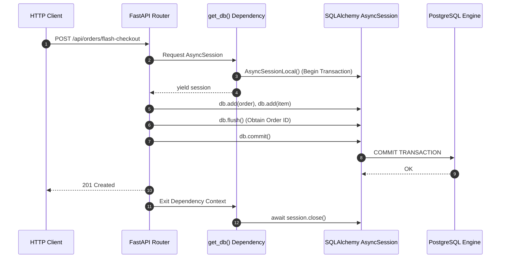

# Database Architecture & Integrity Specification

**Platform:** Podcast Explorer Intelligence Platform & High-Concurrency Engine  
**Database Engine:** PostgreSQL 16 with `pgvector` Extension  
**ORM / Data Access:** SQLAlchemy 2.0 Async (`asyncpg` driver)  
**Migration Tool:** Alembic (Asyncpg Configuration)  
**Status:** Authoritative Specification (Phase 2 Completed)  

---

## 1. Executive Summary

In Phase 2, PostgreSQL was established as the authoritative, transactional source of truth. All critical integrity vulnerabilities identified in `PROJECT_TECHNICAL_AUDIT.md` were resolved:
- **Foreign Key Enforcement:** The broken string `orders.user_id` was migrated to a typed `Integer` foreign key referencing `users.id` with `CASCADE` delete semantics.
- **Inventory Check Constraints:** Database-level `CHECK (stock >= 0)` and `CHECK (price >= 0)` constraints were added to guarantee that the database engine rejects invalid stock or pricing updates.
- **Transactional Discipline:** Removed `Base.metadata.create_all()` from the application startup path in favor of structured Alembic migrations.
- **AsyncSession Lifecycle:** Enhanced dependency injection in `get_db()` with explicit rollback guarantees upon unhandled exceptions.
- **Optimized Indexing:** Created composite and single-column indexes on high-frequency query paths (`orders(user_id, created_at)`, `orders(status)`, `products(title)`, `products(price)`).

---

## 2. Entity-Relationship Diagram

```mermaid
erDiagram
    users ||--o{ orders : places
    users ||--o{ projects : owns
    users ||--o{ saved_searches : creates
    users ||--o{ notifications : receives
    users ||--o{ idempotency_keys : authorizes

    products ||--o{ order_items : references

    orders ||--|{ order_items : contains

    projects ||--o{ episodes : contains
    projects ||--o{ saved_searches : scopes

    episodes ||--o{ speakers : diarizes
    episodes ||--o{ transcript_segments : contains
    episodes ||--o{ chunk_embeddings : indexes
    episodes ||--o{ processing_jobs : tracks
    episodes ||--o| episode_insights : synthesizes

    speakers ||--o{ transcript_segments : attributes
    transcript_segments ||--o{ chunk_embeddings : originates

    users {
        int id PK
        varchar(255) email UK
        varchar(255) hashed_password
        varchar(255) full_name
        timestamptz created_at
        timestamptz updated_at
    }

    products {
        int id PK
        varchar(255) title
        text description
        numeric(10,2) price "CHECK >= 0"
        int stock "CHECK >= 0"
        timestamptz created_at
        timestamptz updated_at
    }

    orders {
        int id PK
        int user_id FK "users.id CASCADE"
        numeric(10,2) total_amount "CHECK >= 0"
        varchar(32) status "CHECK IN ('PENDING','PAID','FAILED','CANCELLED')"
        timestamptz created_at
        timestamptz updated_at
    }

    order_items {
        int id PK
        int order_id FK "orders.id CASCADE"
        int product_id FK "products.id RESTRICT"
        int quantity "CHECK > 0"
        numeric(10,2) unit_price "CHECK >= 0"
    }

    idempotency_keys {
        varchar(128) idempotency_key PK
        int user_id FK "users.id CASCADE"
        varchar(64) request_hash
        int status_code
        json response_body
        timestamptz created_at
    }

    projects {
        int id PK
        int user_id FK "users.id CASCADE"
        varchar(255) name
        text description
        timestamptz created_at
        timestamptz updated_at
    }

    episodes {
        int id PK
        int project_id FK "projects.id CASCADE"
        varchar(255) title
        text description
        varchar(255) original_filename
        varchar(512) audio_url
        bigint file_size
        varchar(64) mime_type
        float duration
        varchar(16) language
        varchar(32) status "uploaded, queued, transcribing, speaker_detection, chunking, embedding, indexing, completed, failed"
        timestamptz created_at
        timestamptz updated_at
        timestamptz processed_at
    }

    speakers {
        int id PK
        int episode_id FK "episodes.id CASCADE"
        varchar(64) label
        varchar(128) display_name
        float speaking_duration
        int segment_count
    }

    transcript_segments {
        int id PK
        int episode_id FK "episodes.id CASCADE"
        int speaker_id FK "speakers.id SET NULL"
        text text
        float start_time
        float end_time
        int sequence_number
        float confidence
    }

    chunk_embeddings {
        int id PK
        int episode_id FK "episodes.id CASCADE"
        int segment_id FK "transcript_segments.id SET NULL"
        text speaker_label
        text chunk_text
        float start_time
        float end_time
        vector(768) embedding "pgvector cosine distance"
        timestamptz created_at
    }

    processing_jobs {
        int id PK
        int episode_id FK "episodes.id CASCADE"
        varchar(32) status
        varchar(64) current_stage
        float progress
        text error_message
        timestamptz started_at
        timestamptz completed_at
    }

    saved_searches {
        int id PK
        int user_id FK "users.id CASCADE"
        int project_id FK "projects.id SET NULL"
        varchar(255) name
        text query
        json filters
        timestamptz created_at
        timestamptz updated_at
    }

    notifications {
        int id PK
        int user_id FK "users.id CASCADE"
        varchar(255) title
        text message
        varchar(64) type
        boolean is_read
        timestamptz created_at
    }

    episode_insights {
        int id PK
        int episode_id UK,FK "episodes.id CASCADE"
        text overview
        json target_competencies
        json core_tech_stack
        json architectural_blueprint
        json resume_transformation
        timestamptz created_at
    }
```

---

## 3. Comprehensive Constraints Matrix

| Table | Constraint Name | Type | Definition / Business Rule | Justification |
| :--- | :--- | :--- | :--- | :--- |
| `users` | `pk_users` | Primary Key | `id` (Integer) | Surrogate identifier. |
| `users` | `ix_users_email` | Unique Index | `email` | Prevents duplicate user accounts. |
| `products` | `chk_products_stock_non_negative` | Check | `stock >= 0` | Prevents inventory overselling at the database engine level. |
| `products` | `chk_products_price_non_negative` | Check | `price >= 0` | Prevents negative catalog pricing. |
| `orders` | `fk_orders_user_id` | Foreign Key | `user_id -> users.id (CASCADE)` | Guarantees every order is owned by a valid user. |
| `orders` | `chk_orders_total_amount_non_negative` | Check | `total_amount >= 0` | Financial integrity for order value. |
| `orders` | `chk_orders_status_valid` | Check | `status IN ('PENDING', 'PAID', 'FAILED', 'CANCELLED')` | Prevents arbitrary invalid status strings. |
| `order_items` | `fk_order_items_order_id` | Foreign Key | `order_id -> orders.id (CASCADE)` | Deleting an order cascades to its line items. |
| `order_items` | `fk_order_items_product_id` | Foreign Key | `product_id -> products.id (RESTRICT)` | Prevents deleting products referenced in existing orders. |
| `order_items` | `chk_order_items_quantity_positive` | Check | `quantity > 0` | Rejects zero or negative order quantities. |
| `order_items` | `chk_order_items_unit_price_non_negative` | Check | `unit_price >= 0` | Protects line-item pricing consistency. |
| `idempotency_keys` | `fk_idempotency_keys_user_id` | Foreign Key | `user_id -> users.id (CASCADE)` | Scopes idempotency keys to user accounts. |
| `projects` | `fk_projects_user_id` | Foreign Key | `user_id -> users.id (CASCADE)` | Ensures workspace isolation per user. |
| `episodes` | `fk_episodes_project_id` | Foreign Key | `project_id -> projects.id (CASCADE)` | Associative containment in projects. |
| `speakers` | `fk_speakers_episode_id` | Foreign Key | `episode_id -> episodes.id (CASCADE)` | Diarized speakers belong to an episode. |
| `transcript_segments` | `fk_transcript_segments_speaker_id` | Foreign Key | `speaker_id -> speakers.id (SET NULL)` | Deleting a speaker preserves transcript text with NULL speaker. |
| `chunk_embeddings` | `fk_chunk_embeddings_episode_id` | Foreign Key | `episode_id -> episodes.id (CASCADE)` | Vector index entries are removed when episode is deleted. |
| `episode_insights` | `uq_episode_insights_episode_id` | Unique / FK | `episode_id -> episodes.id (CASCADE)` | 1-to-1 relationship between episode and its AI insights. |

---

## 4. Indexing Strategy

| Table | Index Name | Columns / Type | Query Access Pattern Benefited |
| :--- | :--- | :--- | :--- |
| `orders` | `idx_orders_user_id_created_at` | `(user_id, created_at DESC)` | Fetches a user's recent order history in sorted chronological order without table scans. |
| `orders` | `idx_orders_status` | `(status)` | Filtering orders by state (`PENDING`, `PAID`) for background settlement and reconciliation. |
| `products` | `idx_products_title` | `(title)` | Fast text lookup and catalog search filtering. |
| `products` | `idx_products_price` | `(price)` | Price range filtering and sorting. |
| `transcript_segments` | `idx_segment_episode_seq` | `(episode_id, sequence_number ASC)` | Fast sequential transcript loading for audio player synchronization. |
| `transcript_segments` | `ix_transcript_segments_start_time` | `(start_time)` | Rapid temporal lookup when deep-linking audio to specific seconds. |
| `chunk_embeddings` | `ix_chunk_embeddings_episode_id` | `(episode_id)` | Project- or episode-scoped vector similarity search. |
| `chunk_embeddings` | `idx_chunk_embeddings_vector` | `embedding (vector_cosine_ops)` | HNSW / IVFFlat cosine similarity distance calculations (`<=>`). |
| `notifications` | `ix_notifications_is_read` | `(is_read)` | Fast retrieval of unread notifications for badge counters. |

---

## 5. Transaction Boundaries & AsyncSession Lifecycle

### Standard Request Lifecycle



### Exception & Rollback Guarantee

```python
# backend/app/api/deps.py
async def get_db() -> AsyncGenerator[AsyncSession, None]:
    async with AsyncSessionLocal() as session:
        try:
            yield session
        except Exception:
            await session.rollback()  # Explicit rollback on unhandled route errors
            raise
        finally:
            await session.close()     # Return connection back to asyncpg pool
```

- **Atomic Commits:** Routes that modify multiple tables (e.g. `orders` + `order_items` + `idempotency_keys`) commit only once at the end of the transaction.
- **Flush vs Commit:** `await db.flush()` is used to obtain generated primary keys (`order.id`) without prematurely ending the transaction.

---

## 6. Migration Strategy & Alembic Configuration

### Alembic Directory Structure
```
backend/
├── alembic.ini                    # Alembic configuration
├── alembic/
│   ├── env.py                     # Async engine configuration importing Base.metadata
│   ├── script.py.mako             # Async migration template
│   └── versions/
│       └── 0001_initial_schema.py # Complete baseline migration
```

### Applying Migrations
```bash
# Upgrade database to latest revision
uv run alembic upgrade head

# Rollback one migration
uv run alembic downgrade -1

# Generate a new auto-detected migration
uv run alembic revision --autogenerate -m "add_new_feature_column"
```

### Data Migration Strategy for Existing Databases (`orders.user_id` String -> Integer)
If upgrading a live database containing legacy string `user_id` values:
1. **Step 1 (Cast Clean Integers):** For rows where `user_id` represents an integer string (e.g. `'1'`), cast directly: `CAST(user_id AS INTEGER)`.
2. **Step 2 (Handle Legacy Strings):** For legacy simulated user strings (e.g. `'user_frontend_1'`), map to a designated fallback demo user (`id = 1`) or extract numeric suffixes using regex (`REGEXP_REPLACE(user_id, '\D', '', 'g')`).
3. **Step 3 (Apply FK Constraint):** Once all values reference valid `users.id` integers, add `ALTER TABLE orders ADD CONSTRAINT fk_orders_user_id FOREIGN KEY (user_id) REFERENCES users(id) ON DELETE CASCADE`.

---

## 7. Verification & Automated Test Coverage

The database integrity test suite ([`backend/tests/test_database_integrity.py`](file:///c:/Users/saura/OneDrive/Desktop/ecommerce/backend/tests/test_database_integrity.py)) validates all database constraints against live sessions:

1. **Foreign Key Integrity:**
   - Attempting to insert an order with an invalid `user_id` raises `IntegrityError`.
   - Attempting to insert an order item with an invalid `product_id` raises `IntegrityError`.
2. **Inventory Check Constraints:**
   - Inserting a product with `stock = -5` raises `IntegrityError` (`chk_products_stock_non_negative`).
   - Inserting a product with `price = -10.00` raises `IntegrityError` (`chk_products_price_non_negative`).
   - Inserting an order item with `quantity = 0` raises `IntegrityError` (`chk_order_items_quantity_positive`).
3. **Unique Email Constraint:**
   - Inserting duplicate emails raises `IntegrityError` (`ix_users_email`).
4. **Cascade Deletions:**
   - Deleting a user automatically deletes all child orders and order items without leaving orphaned records.
5. **Transaction Rollback:**
   - Uncommitted session mutations followed by an error and rollback preserve the original database state.
