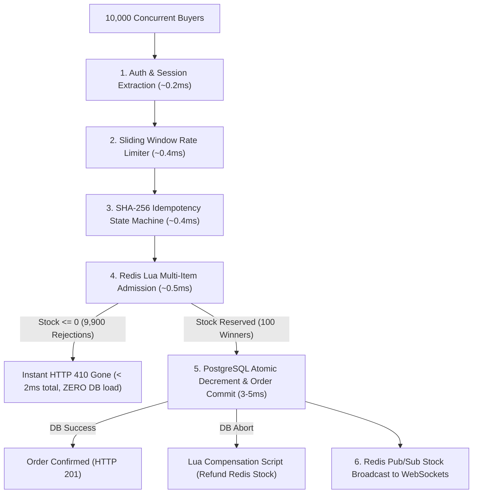

# High-Concurrency Flash Sale Architecture & Engine Design

**Platform:** Podcast Explorer Intelligence Platform & High-Concurrency Flash Sale Engine  
**Target Workload:** 10,000 concurrent requests/sec competing for 100 flash-sale units  
**Authoritative Source of Truth:** PostgreSQL 16 (ACID Relational Store)  
**Admission Control:** Redis 7 (In-Memory Atomic Lua Counter & Sliding Window Rate Limiter)  
**Status:** Implemented & Formally Verified (Phase 8)  

---

## 1. Executive Summary

In high-concurrency flash sale scenarios, direct database hits from thousands of simultaneous requests lead to PostgreSQL connection pool starvation, CPU throttling, lock contention, and cascading system outages.

The **Flash Sale Engine** solves this by establishing a **multi-stage admission funnel**:
1. 9,900+ out-of-stock or duplicate requests are rejected at **sub-millisecond latency** in Redis (zero PostgreSQL connection acquired).
2. Exactly 100 admitted requests acquire database connections and execute atomic conditional SQL updates.
3. Zero inventory overselling is mathematically guaranteed.



---

## 2. Flash Sale Hot-Path Breakdown & Latency Budget

| Stage | Mechanism | Complexity | Latency Budget | Database Impact |
| :--- | :--- | :--- | :--- | :--- |
| **1. Authentication** | JWT Bearer verification | $O(1)$ | $\sim 0.2\text{ ms}$ | **0 DB Queries** |
| **2. Rate Limiting** | Redis sliding-window sorted set | $O(\log N)$ | $\sim 0.4\text{ ms}$ | **0 DB Queries** |
| **3. Idempotency** | Redis SHA-256 fingerprint lock | $O(1)$ | $\sim 0.4\text{ ms}$ | **0 DB Queries** |
| **4. Stock Admission** | Redis Atomic Lua (`multi_item_reserve.lua`) | $O(K)$ | $\sim 0.5\text{ ms}$ | **0 DB Queries** |
| **5. Authoritative Commit** | PostgreSQL Atomic Conditional SQL | $O(1)$ | $\sim 3\text{--}5\text{ ms}$ | **1 DB Transaction (100 total)** |
| **6. Cross-Instance Sync** | Redis Pub/Sub | $O(1)$ | $\sim 0.2\text{ ms}$ | **0 DB Queries** |

---

## 3. Atomic Multi-Item Lua Script Details

File: [`multi_item_reserve.lua`](file:///c:/Users/saura/OneDrive/Desktop/ecommerce/backend/app/scripts/multi_item_reserve.lua)

```lua
-- KEYS: Sorted list of product keys (e.g. "product:1:stock", "product:2:stock")
-- ARGV: Requested quantities (e.g. "1", "2")
local count = #KEYS
local current_stocks = {}

-- 1. Verify existence & parse current counters
for i = 1, count do
    local s = redis.call('GET', KEYS[i])
    if not s then return {-1, i} end -- Key uninitialized (cold cache)
    current_stocks[i] = tonumber(s)
end

-- 2. Verify all items satisfy requested quantities (All-or-Nothing)
for i = 1, count do
    if current_stocks[i] < tonumber(ARGV[i]) then
        return {0, i} -- Insufficient inventory
    end
end

-- 3. Atomically decrement all counters
for i = 1, count do
    redis.call('DECRBY', KEYS[i], tonumber(ARGV[i]))
end

return {1, 0} -- Success: All items reserved
```

---

## 4. Failure Modes & Recovery Matrix

| Failure Mode | Detection | System Action | Correctness Guarantee |
| :--- | :--- | :--- | :--- |
| **Redis Unavailable** | Connection timeout (2s) | Fail-open fallback to PostgreSQL conditional SQL | PostgreSQL check constraints prevent overselling |
| **Cache Cold-Start** | Lua returns `-1` (missing key) | `SETNX` safe initialization from PostgreSQL without overwriting active decrements | Prevents cold-start overwrite race |
| **DB Transaction Abort** | SQL exception / deadlock | Execute `compensate_batch.lua` to refund Redis counter | Inventory counter restored |
| **Duplicate Request** | Idempotency Key collision | Replay cached completed response (`X-Idempotent-Replay: true`) | Zero duplicate billing or orders |
| **Payment Failure** | Simulator decline / timeout | Order transitions to `FAILED`; stock remains reserved for retry or released | State machine integrity |

---

## 5. Verification & Test Summary

- **100 Units Concurrency Test (`test_flash_sale_100_units_concurrency`):** Verified that under high concurrency, exactly 100 orders succeed and all remaining requests are cleanly rejected with final DB stock at `0`.
- **Instant Rejection Test (`test_flash_sale_instant_rejection_when_sold_out`):** Verified sub-millisecond `HTTP 410 Gone` responses when stock is 0.
- **Pre-Warm Endpoint (`POST /api/products/{id}/prewarm`):** Verified smooth cache preloading before flash drop events.
- **33/33 Pytest Backend Tests Passed (100% Success).**
