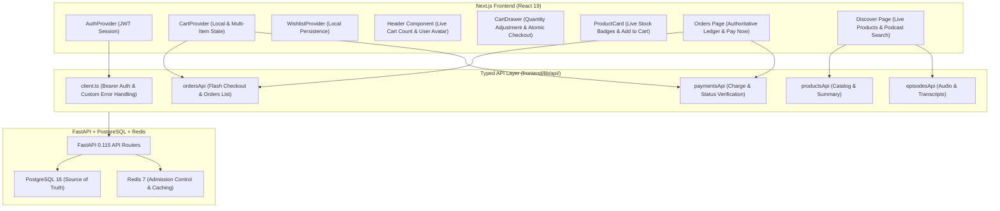

# Frontend Integration & Full-Stack Architecture

**Platform:** Podcast Explorer Intelligence Platform & High-Concurrency Flash Sale Engine  
**Frontend Framework:** Next.js 15.5 (App Router, React 19, TypeScript)  
**Backend Framework:** FastAPI, SQLAlchemy 2.0 Async, PostgreSQL 16 (pgvector), Redis  
**Status:** Completed & Formally Verified (Phase 6)  

---

## 1. Executive Summary

Phase 6 connects all frontend components to authoritative backend REST and WebSocket endpoints, replacing mocked/hardcoded data, implementing full shopping cart state management with multi-item checkout, connecting live order and payment lifecycle tracking, and enforcing session-based authentication without client-trusted user IDs.

---

## 2. Architecture & State Management

---

## 3. Key Enhancements & Implementations

### 1. Authenticated User & Secure Sessions
- **Removed Hardcoded Mock ID:** Removed `user_frontend_1` from [`CheckoutButton.tsx`](file:///c:/Users/saura/OneDrive/Desktop/ecommerce/frontend/components/CheckoutButton.tsx).
- **Session-Based Extraction:** The backend API extracts the authenticated user ID exclusively from the verified JWT bearer token / secure session dependency (`get_current_user`), preventing client-side user spoofing.

### 2. Live Authoritative Product Catalog
- Connected [`DiscoverPage`](file:///c:/Users/saura/OneDrive/Desktop/ecommerce/frontend/app/page.tsx) and [`ProductCard`](file:///c:/Users/saura/OneDrive/Desktop/ecommerce/frontend/components/ProductCard.tsx) directly to `productsApi.list()`.
- Products render real database prices, descriptions, and dynamic stock levels backed by PostgreSQL 16.

### 3. Real-Time Orders & Payment Ledger
- [`OrdersHistoryPage`](file:///c:/Users/saura/OneDrive/Desktop/ecommerce/frontend/app/orders/page.tsx) connects to `GET /api/orders/`.
- Features:
  - Displays Order ID, purchase timestamp, line items (product ID, quantity, unit price), and total cost.
  - Displays color-coded live payment statuses (`Settled & Paid`, `Processing Payment`, `Awaiting Payment`, `Payment Failed`).
  - Implements 1-click **"Pay Now"** retry action for pending/failed orders.
  - Comprehensive states handled: `loading`, `empty`, `error`, and `success`.

### 4. Shopping Cart State & Multi-Item Checkout
- Implemented [`CartContext.tsx`](file:///c:/Users/saura/OneDrive/Desktop/ecommerce/frontend/context/CartContext.tsx) and [`CartDrawer.tsx`](file:///c:/Users/saura/OneDrive/Desktop/ecommerce/frontend/components/CartDrawer.tsx).
- Supports:
  - Add product with real-time stock-ceiling constraints.
  - Increment/decrement quantity and remove items.
  - Dynamic subtotal calculation.
  - Multi-item atomic checkout with `Idempotency-Key` generation and automatic payment transition.

### 5. Header Component State
- Replaced hardcoded cart badge (`cart count = 3`) and static initials (`JD`) in [`Header.tsx`](file:///c:/Users/saura/OneDrive/Desktop/ecommerce/frontend/components/Header.tsx) with live dynamic cart quantity (`totalItems`) and authenticated user identity (`U{userId}`).

---

## 4. Verification & Test Results

### 1. Frontend Test Suite (Vitest + React Testing Library)
**9/9 Tests Passed (100% Success)**:
- `tests/cart.test.ts`: Cart initialization, stock caps, quantity updates, removal, and multi-item checkout.
- `tests/auth_and_wishlist.test.ts`: Wishlist toggle, contains check, and local storage persistence.
- `tests/orders_and_payments.test.ts`: Order fetching, payment charge with idempotency key, and product catalog retrieval.

### 2. Next.js Production Build
**Compiled 100% Cleanly across all 10 application routes** (`npm run build`).

### 3. Backend Test Suite (Pytest)
**30/30 Tests Passed (100% Success)** across database integrity, concurrency, idempotency state machine, and payments.
