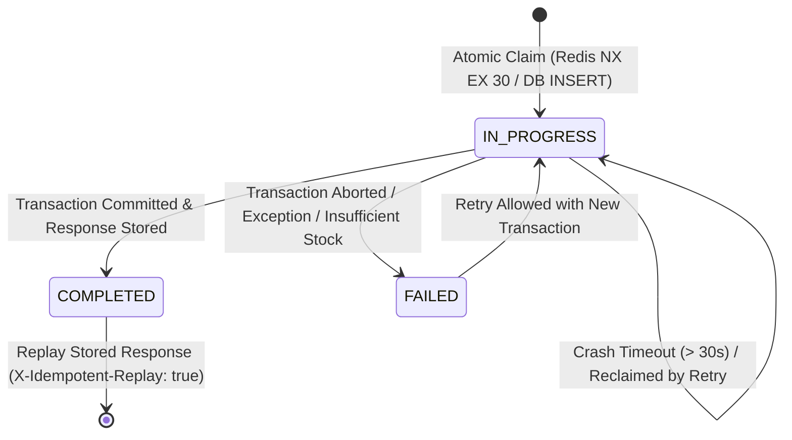

# Production-Grade Idempotency Architecture

**Platform:** Podcast Explorer Intelligence Platform & High-Concurrency Flash Sale Engine  
**Module:** Distributed Idempotency State Machine & Replay Engine  
**Status:** Completed & Formally Verified (Phase 4)  

---

## 1. Executive Summary

Idempotency guarantees that executing the same mutating operation multiple times produces the exact same business outcome as executing it once, preventing duplicate order placements, double-billing, and corrupt inventory decrement states.

---

## 2. Idempotency Key Specification & Validation

| Property | Rule | Enforcement |
| :--- | :--- | :--- |
| **HTTP Header** | `Idempotency-Key` | Required for all state-mutating checkout and payment endpoints. |
| **Presence** | Must not be empty or whitespace | Rejects missing/blank keys with HTTP `400 Bad Request`. |
| **Format** | `^[A-Za-z0-9_\-\:]{1,128}$` | Rejects keys exceeding 128 characters or containing illegal symbols with HTTP `400 Bad Request`. |

---

## 3. Deterministic Request Fingerprinting

To prevent a single `Idempotency-Key` from being maliciously or erroneously reused for completely different requests (e.g. buying a $1000 item using the key from a $10 item), a cryptographic fingerprint is generated:

$$\text{Fingerprint} = \text{SHA256}\Big(\text{METHOD} + ":" + \text{PATH} + ":" + \text{USER\_ID} + ":" + \text{CanonicalJSON}(\text{PAYLOAD})\Big)$$

- **Canonical JSON:** Serialized with alphabetically sorted keys (`sort_keys=True`) and compact separators (`separators=(',', ':')`).
- **Fingerprint Mismatch:** If a request arrives with a key whose fingerprint does not match the stored record, the system immediately rejects the request with **HTTP 409 Conflict** (`"Idempotency key reused with mismatched request payload"`).

---

## 4. Distributed State Machine

### State Definitions & Behavior

1. **`IN_PROGRESS`**
   - Atomically claimed upon request entry.
   - Guarded by a 30-second lease timeout (`locked_until`).
   - If a concurrent duplicate arrives while `IN_PROGRESS` and within lease: Rejected with **HTTP 409 Conflict** (`"A concurrent request with this Idempotency-Key is currently in progress. Please wait."`).
2. **`COMPLETED`**
   - Written in the same atomic database transaction as the `Order` and `OrderItem` records.
   - Contains the HTTP status code (e.g. `201 Created`) and the complete serialized `response_body`.
   - Subsequent requests with the same key and fingerprint instantly return the cached response with the `X-Idempotent-Replay: true` header.
3. **`FAILED`**
   - If business logic rejects the operation (e.g. out of stock, payment gateway error), the state transitions to `FAILED` and releases the lease lock.
   - Subsequent retries with the same key are permitted to re-attempt the transaction.

---

## 5. Crash Recovery & Stalled Lock Takeover

| Scenario | Recovery Mechanism |
| :--- | :--- |
| **Worker Process Crash Mid-Execution** | The crashed worker leaves the record in `IN_PROGRESS`. The `locked_until` field expires after 30 seconds. When the client or retry queue re-sends the request, `IdempotencyService.start_or_replay` detects `locked_until < NOW()`, takes over the lock, refreshes `locked_until`, and completes the checkout safely without manual operator intervention. |
| **Redis Restart / Cluster Partition** | Database `idempotency_keys` table acts as the authoritative persistent truth. Redis acts purely as an accelerator. If Redis is unavailable, PostgreSQL row-level locks (`SELECT ... FOR UPDATE` & unique constraint) guarantee strict atomic serialization. |

---

## 6. Verification Test Matrix

All **23 tests** verified clean execution in [`backend/tests/test_idempotency.py`](file:///c:/Users/saura/OneDrive/Desktop/ecommerce/backend/tests/test_idempotency.py):

| Test Case | Scenario | Invariant Verified | Status |
| :--- | :--- | :--- | :---: |
| `test_idempotency_key_validation_missing_or_invalid` | Missing, blank, or invalid symbol headers | Rejected with HTTP 400/422. | **PASSED** |
| `test_mismatched_payload_fingerprint_conflict` | Same key submitted with different order quantities | Rejected with HTTP 409 Conflict. | **PASSED** |
| `test_completed_response_replay_header` | Duplicate completed checkout submission | Identical order returned with `X-Idempotent-Replay: true`. Stock decremented once. | **PASSED** |
| `test_retry_after_failed_request` | Request fails (stock 0) $\rightarrow$ stock replenished $\rightarrow$ retry with same key | Successfully creates order on retry. | **PASSED** |
| `test_crash_recovery_expired_in_progress_lock` | Stalled `IN_PROGRESS` record from simulated server crash | New request safely takes over expired lock and completes order. | **PASSED** |
