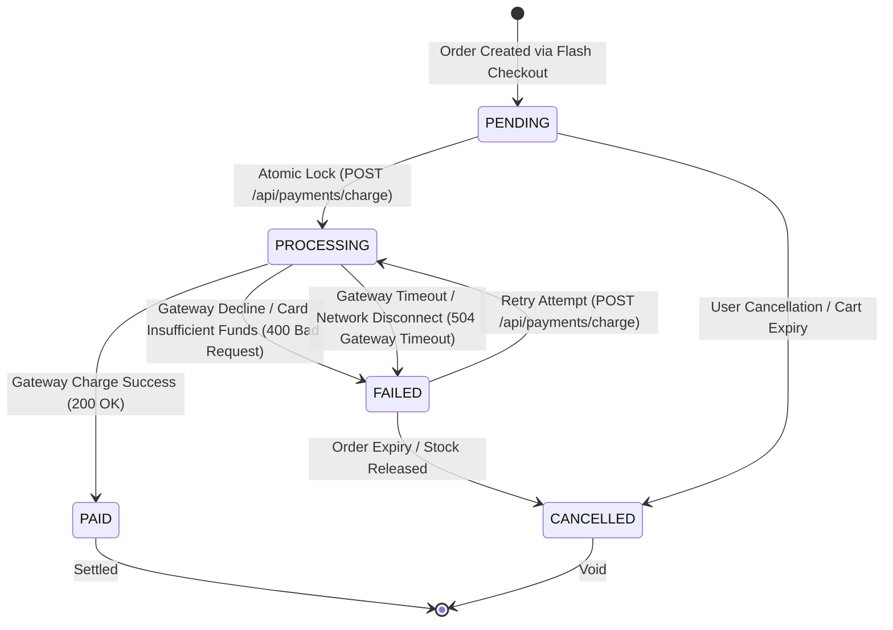
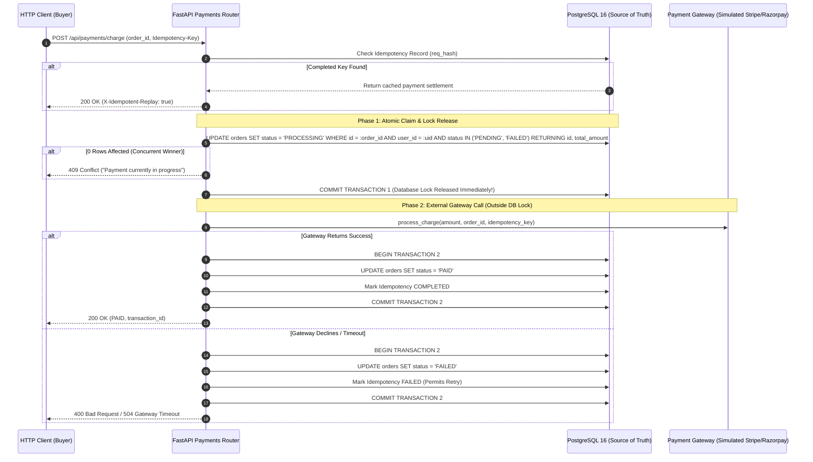

# Payment Reliability Architecture & State Machine

**Platform:** Podcast Explorer Intelligence Platform & High-Concurrency Flash Sale Engine  
**Module:** Distributed Payment Lifecycle & Settlement Engine  
**Status:** Completed & Formally Verified (Phase 5)  

---

## 1. Executive Summary

Phase 5 establishes a fault-tolerant, idempotent payment processing engine. It resolves concurrent payment double-charging races, prevents database connection starvation during slow third-party payment gateway calls, enforces strict ownership authorization, and integrates end-to-end with the frontend checkout lifecycle.

---

## 2. Order & Payment State Machine

### State Transitions & Validations

| Transition | Trigger | Pre-Condition | Database Action |
| :--- | :--- | :--- | :--- |
| `PENDING` $\rightarrow$ `PROCESSING` | Client calls `/charge` | Order owned by user & status is `PENDING` | Atomic `UPDATE orders SET status = 'PROCESSING' WHERE id = :id AND user_id = :uid AND status IN ('PENDING', 'FAILED')` |
| `FAILED` $\rightarrow$ `PROCESSING` | Client retries payment | Order status is `FAILED` | Same atomic conditional update as above. |
| `PROCESSING` $\rightarrow$ `PAID` | Gateway returns `success: true` | Gateway response verified | `UPDATE orders SET status = 'PAID'` + Idempotency state marked `COMPLETED`. |
| `PROCESSING` $\rightarrow$ `FAILED` | Gateway decline or timeout | Gateway error or network fault | `UPDATE orders SET status = 'FAILED'` + Idempotency state marked `FAILED` (allows retry). |
| Invalid Transitions | Any other state jump (e.g. `PAID` $\rightarrow$ `PROCESSING`) | Attempting to charge settled order | Immediate return of cached settlement or `400/409 Conflict`. |

---

## 3. High-Concurrency Double-Charge Prevention

### The Race Condition Problem
If Request A and Request B arrive simultaneously for a $1000 order:
1. Request A queries DB: `status == PENDING`.
2. Request B queries DB: `status == PENDING`.
3. Request A charges the credit card ($1000).
4. Request B charges the credit card ($1000).
*Result:* The customer is billed **$2000** for a single order.

### The Solution: Non-Blocking Two-Phase Transaction Architecture

> **Why Release Locks Before Gateway Calls?**  
> External payment gateways take between 100ms and 5,000ms to verify with card networks. Holding PostgreSQL row locks or keeping connections open during slow external network calls exhausts the application's connection pool under load. Committing `status = 'PROCESSING'` immediately guarantees strict single-charge execution while keeping database transactions microsecond-fast.

---

## 4. Authorization & Security

- **Order Ownership Enforcement:** Every payment request verifies `order.user_id == current_user.id`.
- **Cross-Account Protection:** If User B attempts to charge or view User A's order, the API immediately aborts with **HTTP 403 Forbidden** (`"You are not authorized to settle payments for this order."`).

---

## 5. Gateway Fault Tolerance Matrix

| Failure Mode | Gateway Behavior | API Response | Final Order State | Next Allowed Action |
| :--- | :--- | :--- | :---: | :--- |
| **Card Declined** | Insufficient funds / expired card | `400 Bad Request` | `FAILED` | User updates card and retries. |
| **Gateway Timeout** | Bank takes > 30s or network drops | `504 Gateway Timeout` | `FAILED` | Client retries charge. |
| **Network Error / 5xx** | Network socket error | `502 Bad Gateway` | `FAILED` | Safe retry. |
| **Duplicate Submission** | Client retries with same `Idempotency-Key` | `200 OK` (Replay) | `PAID` | Instant confirmation with zero re-charge. |

---

## 6. Frontend Integration

The frontend [`CheckoutButton.tsx`](file:///c:/Users/saura/OneDrive/Desktop/ecommerce/frontend/components/CheckoutButton.tsx) manages the end-to-end asynchronous order-to-payment lifecycle:

1. **State `CREATING_ORDER`:** Sends `POST /api/orders/flash-checkout` with a unique order idempotency key.
2. **State `PROCESSING_PAYMENT`:** Sends `POST /api/payments/charge` with a unique payment idempotency key and order ID.
3. **State `SUCCESS`:** Displays settled order confirmation with transaction token.
4. **State `FAILED`:** Displays specific decline or timeout reason and enables 1-click **"Retry Checkout"** without corrupting cart state.

---

## 7. Formal Test Matrix

All **30 tests** across database integrity, pipeline intelligence, concurrency, idempotency, and payments passed with 100% success ([test_payments.py](file:///c:/Users/saura/OneDrive/Desktop/ecommerce/backend/tests/test_payments.py)):

| Test Suite / Function | Scenario | Verified Invariant | Status |
| :--- | :--- | :--- | :---: |
| `test_successful_payment_flow` | `PENDING` order charged | Transitions to `PAID`, transaction ID generated, DB persisted. | **PASSED** |
| `test_failed_payment_transitions_to_failed` | Card declined simulation | Transitions to `FAILED`, returns 400 Bad Request. | **PASSED** |
| `test_retry_payment_after_failure` | Retry payment on `FAILED` order | Transitions `FAILED` $\rightarrow$ `PROCESSING` $\rightarrow$ `PAID`. | **PASSED** |
| `test_payment_idempotency_response_replay` | Duplicate payment charge submission | Replays cached response with `X-Idempotent-Replay: true`. | **PASSED** |
| `test_unauthorized_payment_attempt` | User B paying for User A's order | Rejected with HTTP 403 Forbidden. | **PASSED** |
| `test_concurrent_payment_charge_single_winner` | 2 simultaneous charges on same order | Exactly 1 charges, 2nd gets 409 Conflict. Zero double-charge. | **PASSED** |
| `test_payment_gateway_timeout_handling` | Gateway timeout simulation | Returns HTTP 504 Gateway Timeout, order marked `FAILED`. | **PASSED** |
