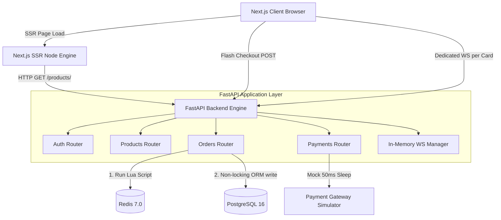
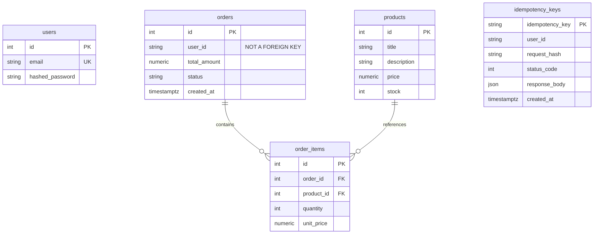
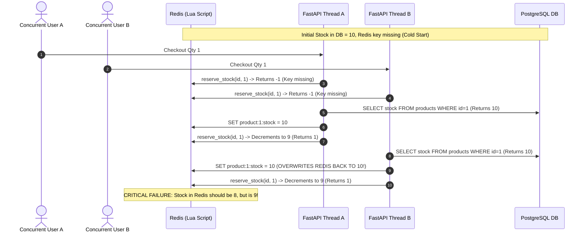
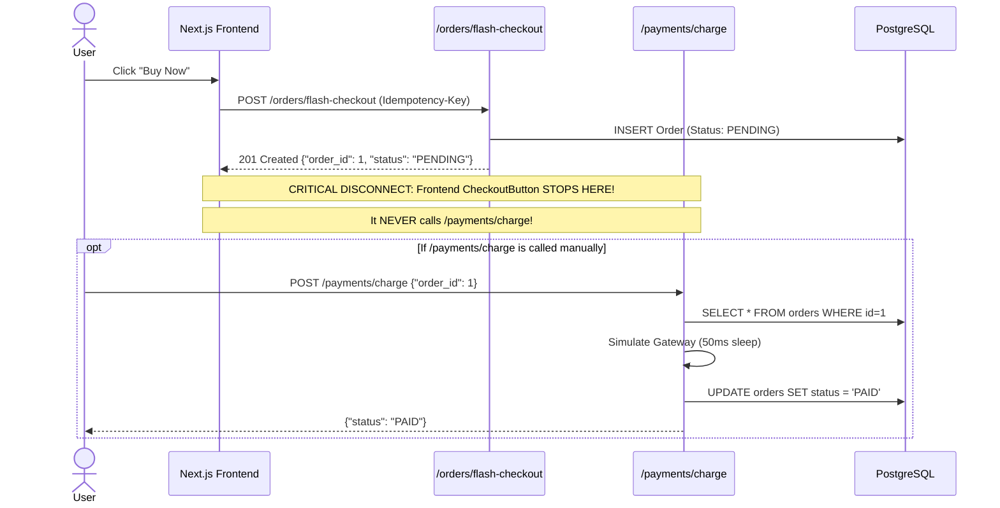

# Project Technical Audit: Equinox High-Concurrency E-Commerce & Flash Sale Engine

**Audit Date:** August 30, 2026  
**Auditor:** Senior Full-Stack Architect & Distributed Systems Engineer  
**Codebase Evaluated:** `ecommerce` (FastAPI Async Backend + Next.js 15 App Router Frontend + PostgreSQL + Redis)  
**Classification:** Pre-Production Architectural & Concurrency Assessment  

---

## 1. Executive Summary

A comprehensive architectural and code-level audit was conducted on the Equinox e-commerce repository. The stated objective is to evolve this codebase into a production-grade, high-concurrency e-commerce and flash sale platform capable of handling extreme spikes (e.g., tens of thousands of requests per second during inventory drops) without data corruption, overselling, lost updates, or payment anomalies.

### Key Verdict
The current codebase is a **hybrid proof-of-concept (PoC)**. While it incorporates modern foundational frameworks (FastAPI with `asyncpg`, SQLAlchemy 2.0 Async, Redis Lua scripting, and Next.js 15 App Router), **it is currently unsafe for production deployment and will fail catastrophically under flash sale load**.

### Critical Red Flags Identified
1. **False Concurrency Safety (Dual-Write Desynchronization):** While inventory is decremented atomically in Redis via a Lua script, the relational database decrement uses an in-memory non-atomic Python calculation (`product.stock -= target_item.quantity`) without pessimistic row locking (`SELECT FOR UPDATE`), optimistic locking (`version_id_col`), or atomic SQL expressions (`UPDATE ... WHERE stock >= qty`).
2. **Fatal Cache Stampede on Cold Starts:** If a product key is missing in Redis during checkout, the system falls back to querying the database and executes an unconditional `SET` to Redis. Under concurrent load, multiple threads will overwrite in-flight Redis stock counts with stale DB snapshots, leading to severe overselling.
3. **Broken Distributed Idempotency:** The idempotency check queries PostgreSQL (`db.get(IdempotencyRecord, key)`) without a distributed lock (`SET NX EX` in Redis) or database row lock. Concurrent duplicate requests bypass the check simultaneously, reserving multiple stock allocations in Redis before one crashes on database commit due to primary key conflict.
4. **Authentication & Authorization Vacuum:** The core transaction endpoints (`POST /orders/flash-checkout`, `POST /payments/charge`, `POST /products/`) do **not** enforce JWT authentication dependencies (`Depends(get_current_user)`). The backend accepts an arbitrary `user_id` string from the JSON payload. Any anonymous actor can place orders or trigger payment settlement under any user's ID.
5. **WebSocket Scalability Trap:** Every product card on the frontend opens an isolated WebSocket connection. A visitor viewing 30 items spawns 30 persistent WebSocket connections. On the backend, connections are stored in a raw in-memory Python list without Redis Pub/Sub, crashing single instances and making horizontal scaling impossible.
6. **Frontend Disconnection:** Cart checkout does not exist; order history on the frontend is completely hardcoded mock data; categories and wishlist read exclusively from a static JSON file (`products.json`); and the payment settlement endpoint is never called after checkout.

---

## 2. Repository Structure

```
ecommerce/
├── .agents/
│   ├── rules/
│   │   ├── ecommerce.md            # Systems engineering & concurrency guidelines
│   │   └── frontend-design.md      # UI/UX & micro-interaction standards
│   └── workflows/
│       ├── api.md                  # Workflow for backend route development
│       ├── debug.md                # Root-cause debugging workflow
│       ├── feature.md              # Full-stack feature integration workflow
│       └── ui-polish.md            # Frontend UI enhancement workflow
├── backend/
│   ├── alembic/                    # [CRITICAL ISSUE: Directory is completely empty; no migrations]
│   ├── app/
│   │   ├── api/
│   │   │   ├── deps.py             # Database and Redis dependency injection
│   │   │   └── routers/
│   │   │       ├── auth.py         # Registration & login (JWT generation)
│   │   │       ├── orders.py       # Flash checkout route (single-item only)
│   │   │       ├── payments.py     # Mock payment processing route
│   │   │       └── products.py     # Product CRUD & WebSocket stock endpoint
│   │   ├── core/
│   │   │   ├── config.py           # Pydantic Settings (DB & Redis connection strings)
│   │   │   ├── database.py         # SQLAlchemy async engine & sessionmaker
│   │   │   └── security.py         # Passlib bcrypt hashing & PyJWT token utilities
│   │   ├── middlewares/
│   │   │   └── idempotency.py      # Standalone idempotency verification function (unused in middleware stack)
│   │   ├── models/
│   │   │   ├── idempotency.py      # IdempotencyRecord ORM model
│   │   │   ├── order.py            # Order and OrderItem ORM models
│   │   │   ├── product.py          # Product ORM model
│   │   │   └── user.py             # User ORM model
│   │   ├── scripts/
│   │   │   └── inventory_lock.lua  # Lua script for Redis stock verification & decrement
│   │   └── services/
│   │       ├── payment_service.py  # Mock async payment gateway simulator (50ms sleep)
│   │       ├── redis_service.py    # Redis client wrapper & Lua script execution
│   │       └── websocket_service.py# In-memory WebSocket ConnectionManager
│   ├── tests/
│   │   └── load_test.py            # Basic asyncio/httpx concurrency test (100 requests)
│   ├── .env.local                  # Environment configuration
│   ├── docker-compose.yml          # PostgreSQL 16 & Redis 7 container orchestration
│   ├── main.py                     # FastAPI entrypoint, lifespan handler, CORS configuration
│   ├── pyproject.toml              # Dependencies managed via uv
│   └── uv.lock                     # Locked Python dependencies
├── frontend/
│   ├── app/
│   │   ├── categories/
│   │   │   └── page.tsx            # Category grouping (reads static products.json)
│   │   ├── login/
│   │   │   └── page.tsx            # Form login submitting to /auth/login
│   │   ├── orders/
│   │   │   └── page.tsx            # Orders history table (100% hardcoded mock data)
│   │   ├── register/
│   │   │   └── page.tsx            # User registration submitting to /auth/register
│   │   ├── settings/
│   │   │   └── page.tsx            # User settings & sign-out page
│   │   ├── wishlist/
│   │   │   └── page.tsx            # Wishlist display (reads static products.json + localStorage)
│   │   ├── globals.css             # Tailwind base styles
│   │   ├── layout.tsx              # Root HTML layout with Auth & Wishlist providers
│   │   └── page.tsx                # Discovery page (hybrid: backend SSR + static JSON)
│   ├── components/
│   │   ├── CheckoutButton.tsx      # Flash checkout trigger (hardcoded user_frontend_1)
│   │   ├── Header.tsx              # Navigation bar with search input and static cart count (3)
│   │   ├── LiveStockBadge.tsx      # Dedicated WebSocket consumer per product card
│   │   ├── ProductCard.tsx         # Product display card with wishlist & checkout actions
│   │   └── Sidebar.tsx             # Main desktop navigation sidebar
│   ├── context/
│   │   ├── AuthContext.tsx         # Auth state provider (token & user ID in localStorage)
│   │   └── WishlistContext.tsx     # Wishlist state provider (IDs persisted in localStorage)
│   ├── data/
│   │   └── products.json           # Static Indian e-commerce mock dataset
│   ├── hooks/
│   │   └── use-mobile.ts           # Media query hook for responsive layout
│   ├── lib/
│   │   └── utils.ts                # Tailwind clsx + twMerge helper
│   ├── .env.local                  # NEXT_PUBLIC_API_URL configuration
│   ├── next.config.ts              # Next.js configuration (standalone output, picsum remote images)
│   ├── package.json                # Frontend dependencies
│   └── tsconfig.json               # TypeScript compiler options
```

---

## 3. Technology Stack

| Layer | Technology | Declared Version | Production Readiness Verdict |
| :--- | :--- | :--- | :--- |
| **Backend Framework** | FastAPI | `^0.115.0` | **Production Ready** — Asynchronous ASGI framework. |
| **ASGI Server** | Uvicorn (standard) | `^0.30.0` | **Needs Tuning** — Single process in dev; requires Gunicorn worker management or containerized replicas in prod. |
| **ORM / Query Engine** | SQLAlchemy (asyncio) | `^2.0.30` | **Partially Ready** — Utilized incorrectly; lacks atomic update queries and row locks. |
| **Database Driver** | asyncpg | `^0.29.0` | **Production Ready** — High-performance async PostgreSQL driver. |
| **Caching & In-Memory Store**| Redis (redis-py async) | `^5.0.0` | **Partially Ready** — Single client instance; lacks cluster/sentinel support, connection backoff, and distributed locks. |
| **Auth & Security** | PyJWT, Passlib (bcrypt) | `^2.13.0`, `^1.7.4` | **Critical Risks** — Hardcoded secrets; missing auth guards on API routes; no token revocation. |
| **Validation & Settings** | Pydantic v2, pydantic-settings | `^2.13.4`, `^2.2.0` | **Production Ready** — Fast Rust-core data validation. |
| **Frontend Framework** | Next.js (App Router) | `^15.4.9` | **Production Ready** — Modern hybrid SSR/CSR engine. |
| **UI Library & React** | React, React DOM | `^19.2.1` | **Cutting Edge** — React 19. |
| **Styling & Animation** | Tailwind CSS, Motion | `4.1.11`, `^12.23.24` | **Production Ready** — Modern utility styles and spring physics. |
| **Database Infrastructure** | PostgreSQL (Docker) | `16-alpine` | **Dev Only** — Single container mapped to host port 5433. |
| **Cache Infrastructure** | Redis (Docker) | `7-alpine` | **Dev Only** — Single standalone node without persistence tuning or replication. |

---

## 4. Architecture

### 4.1 Current Architecture Overview



### 4.2 Architectural Deficiencies
1. **Synchronous Request-Response Bottleneck:** When a flash sale checkout request is received, the thread synchronously executes:
   - SHA-256 serialization and database query for idempotency.
   - Network call to Redis for Lua script execution.
   - Potential fallback database fetch and Redis set.
   - Relational database write to `orders` and `order_items`.
   - Relational database update to `products` stock.
   - Relational database insert to `idempotency_keys`.
   - In-memory WebSocket broadcast loop over all active connections.
   
   *Result:* Flash sale latency degrades immediately under concurrent load, leading to thread pool starvation, database connection exhaustion, and request timeouts.

2. **Tight State Coupling & Single-Point-of-Failure in WebSockets:**
   `ConnectionManager` in `backend/app/services/websocket_service.py` maintains `self.active_connections: list[WebSocket]`. If multiple Uvicorn instances or containers are deployed behind a load balancer, an order processed on Instance A will **only** notify the WebSocket clients connected to Instance A. Clients connected to Instance B will receive zero updates.

3. **Absence of an Asynchronous Event / Worker Pipeline:**
   There is no message broker (Kafka, RabbitMQ, or Redis Streams) and no background task worker (Celery, ARQ, or Dramatiq). Order fulfillment, email notifications, payment settlement, and stock reconciliation are bound to the synchronous HTTP lifecycle.

---

## 5. Frontend Architecture

### 5.1 Component Inventory & File Map

| Component / Page | File Location | Responsibility | Production Readiness Issues |
| :--- | :--- | :--- | :--- |
| `ShopPage` | `frontend/app/page.tsx` | SSR root catalog rendering | Mixes live backend products with static JSON file (`products.json`). Uses `cache: 'no-store'` disabling CDN edge caching. |
| `ProductCard` | `frontend/components/ProductCard.tsx` | Product visual display | Renders either dynamic `LiveStockBadge` or static tags. Inconsistently formats currencies (`$` vs `₹`). |
| `CheckoutButton` | `frontend/components/CheckoutButton.tsx` | Order dispatch trigger | Hardcodes `user_id: "user_frontend_1"`. Generates UUID client-side. Ignores authenticated user. Never initiates payment charge. |
| `LiveStockBadge` | `frontend/components/LiveStockBadge.tsx` | Real-time stock display | **Critical bug:** Spawns a new `WebSocket` instance per mounted component. |
| `Header` | `frontend/components/Header.tsx` | Global top navigation | Hardcoded shopping cart badge (`3`), non-functional search bar, static profile initials (`JD`). |
| `Sidebar` | `frontend/components/Sidebar.tsx` | Global navigation sidebar | Conditionally swaps Settings/Login links based on `AuthContext`. |
| `OrdersPage` | `frontend/app/orders/page.tsx` | Orders management | **100% Hardcoded static mock array**. Zero API integration with backend `/orders`. |
| `WishlistPage` | `frontend/app/wishlist/page.tsx` | User wishlist view | Pure client-side filtering against `products.json` based on IDs stored in `localStorage`. |
| `CategoriesPage` | `frontend/app/categories/page.tsx` | Catalog categorization | Pure client-side grouping against `products.json`. Does not fetch backend products. |
| `LoginPage` | `frontend/app/login/page.tsx` | User authentication | Submits `x-www-form-urlencoded` to `/auth/login`. Saves token to `localStorage`. |
| `RegisterPage` | `frontend/app/register/page.tsx` | User registration | Submits JSON to `/auth/register`. Saves token to `localStorage`. |
| `SettingsPage` | `frontend/app/settings/page.tsx` | User profile settings | Client-side protected route checking `userId !== null`. Basic sign-out handler. |
| `AuthContext` | `frontend/context/AuthContext.tsx` | Global authentication state | Reads/writes unencrypted JWT to `localStorage`. Exposes XSS vulnerability. |
| `WishlistContext` | `frontend/context/WishlistContext.tsx` | Global wishlist state | Serializes array of IDs to `localStorage`. No backend persistence. |

### 5.2 Frontend Vulnerabilities & Anti-Patterns
1. **WebSocket Connection Multiplication:**
   ```typescript
   // frontend/components/LiveStockBadge.tsx (Lines 13-17)
   useEffect(() => {
     const wsUrl = process.env.NEXT_PUBLIC_WS_URL || 'ws://localhost:8000/products/ws/stock';
     const ws = new WebSocket(wsUrl);
     // ...
   }, [productId]);
   ```
   Mounting 30 product cards opens 30 concurrent TCP WebSocket connections from a single browser tab. If 5,000 shoppers view the page simultaneously, the backend is slammed with 150,000 WebSocket connections.
2. **Security Leak via LocalStorage:**
   `AuthContext.tsx` stores JWT tokens in `localStorage.setItem('equinox_token', newToken)`. Any third-party script or Cross-Site Scripting (XSS) vulnerability can immediately exfiltrate user session tokens. Standard practice requires `httpOnly`, `Secure`, `SameSite=Strict` cookies.
3. **Ghost Cart & Fragmented Data:**
   The UI displays a cart icon with "3" items, but no cart context, cart drawer, cart storage, or multi-item checkout logic exists in the entire frontend.

---

## 6. Backend Architecture

### 6.1 Route & Service Map

| Domain | Route / File | Function / Handler | Dependencies | Implementation Reality |
| :--- | :--- | :--- | :--- | :--- |
| **Lifespan** | `backend/main.py` | `lifespan(app)` | `engine`, `redis_service` | Auto-creates tables via `Base.metadata.create_all`. Connects/closes Redis. |
| **Auth** | `POST /auth/register` | `register()` in `routers/auth.py` | `get_db` | Hashes password with bcrypt. Creates user. Returns 7-day JWT. |
| **Auth** | `POST /auth/login` | `login()` in `routers/auth.py` | `get_db` | Validates credentials via OAuth2 form data. Returns 7-day JWT. |
| **Products** | `POST /products/` | `create_product()` in `routers/products.py` | `get_db`, `get_redis` | Creates product in DB. Executes `redis.set(f"product:{id}:stock", stock)`. **Unprotected route**. |
| **Products** | `GET /products/{id}` | `get_product()` in `routers/products.py` | `get_db` | Fetches single product by ID. |
| **Products** | `GET /products/` | `list_products()` in `routers/products.py` | `get_db` | `SELECT * FROM products` without pagination, search, or category filtering. |
| **Products** | `WS /products/ws/stock` | `websocket_stock_endpoint()` in `routers/products.py` | `manager` | Registers socket in in-memory list. Loops infinitely on `receive_text()`. |
| **Orders** | `POST /orders/flash-checkout` | `flash_checkout()` in `routers/orders.py` | `get_db`, `get_redis`, `Idempotency-Key` | Executes Redis Lua reservation -> writes Order -> updates DB stock -> broadcasts WS. |
| **Payments** | `POST /payments/charge` | `charge_order()` in `routers/payments.py` | `get_db` | Fetches order -> calls simulator -> updates order status to `PAID` or `FAILED`. |

---

## 7. Database Architecture

### 7.1 Entity-Relationship Analysis



### 7.2 Database Deficiencies & Schema Bugs
1. **Broken Foreign Key Integrity:**
   In `backend/app/models/order.py` (Line 9):
   ```python
   user_id = Column(String(64), nullable=False, index=True)
   ```
   `orders.user_id` is defined as a plain string, while `users.id` in `backend/app/models/user.py` is an `Integer`. There is **no Foreign Key constraint**. Orders can be orphaned or created for non-existent users.
2. **Missing Database-Level Stock Constraint:**
   The `products` table does not have a `CHECK (stock >= 0)` constraint. If a race condition or buggy decrement occurs, PostgreSQL will happily allow stock to become negative (`-1`, `-50`, etc.).
3. **Empty Alembic Directory:**
   `backend/alembic/` is completely empty. There is no `env.py`, `script.py.mako`, or `versions/` folder. The application relies on `conn.run_sync(Base.metadata.create_all)` in `main.py`. This means any future column addition, type alteration, or index modification cannot be applied safely in production without dropping or manually altering tables.
4. **Missing Production Indexes:**
   - No composite index on `orders(user_id, created_at DESC)`.
   - No index on `orders(status)`.
   - No indexes on `products(price)` or `products(title)`.

---

## 8. API Architecture & Standards

### 8.1 API Audit Matrix

| Endpoint | Method | Input Contract | Response Contract | Status Codes | Auth Enforced? | Idempotency? |
| :--- | :--- | :--- | :--- | :--- | :--- | :--- |
| `/auth/register` | `POST` | `UserCreate` (email, password) | `Token` (access_token, token_type, user_id) | `201`, `400` | No (Public) | No |
| `/auth/login` | `POST` | `OAuth2PasswordRequestForm` | `Token` (access_token, token_type, user_id) | `200`, `401` | No (Public) | No |
| `/products/` | `POST` | `ProductCreate` | `Product` | `201` | **NO (CRITICAL LEAK)** | No |
| `/products/` | `GET` | None | `list[Product]` | `200` | No (Public) | No |
| `/products/{id}` | `GET` | Path param `id: int` | `Product` | `200`, `404` | No (Public) | No |
| `/products/ws/stock` | `WS` | WebSocket upgrade | JSON stock stream | `101` | No | N/A |
| `/orders/flash-checkout` | `POST` | `CreateOrderRequest`, `Idempotency-Key` header | JSON Order summary | `201`, `409`, `410`, `404` | **NO (CRITICAL LEAK)** | Broken (DB Only) |
| `/payments/charge` | `POST` | `PaymentRequest` (order_id) | JSON Status | `200`, `400`, `404` | **NO (CRITICAL LEAK)** | **NO** |

### 8.2 API Deficiencies
- **No API Versioning:** All routes are mounted directly at root (`/products`, `/orders`, `/payments`). Production systems must use `/api/v1/`.
- **Missing Standard Error Envelope:** Error responses vary between FastAPI standard `{"detail": "..."}` and custom dictionaries.
- **Unused Middleware:** `backend/app/middlewares/idempotency.py` defines a helper function `verify_idempotency()`, but it is **never registered as FastAPI middleware** or used as a route dependency. `orders.py` re-implements a different, flawed version inline.

---

## 9. Authentication & Authorization

### 9.1 Implementation Analysis
- **Token Format:** HMAC-SHA256 JWT generated via `pyjwt`.
- **Password Hashing:** Passlib with `bcrypt` algorithm.
- **Expiration:** Hardcoded to `60 * 24 * 7` minutes (7 days) without refresh token rotation.

### 9.2 Critical Security Vulnerabilities
1. **Hardcoded Secret Key:**
   `backend/app/core/security.py` (Line 5):
   ```python
   SECRET_KEY = "your-secret-key-here"  # In production, use environment variables
   ```
   The secret key is hardcoded directly in the source file. Anyone with access to the repo can forge administrative JWT tokens.
2. **Complete Absence of Authorization Checks:**
   There is **no Role-Based Access Control (RBAC)**. There is no `is_admin` or `role` column in the `users` table. The endpoint `POST /products/` allows any unauthenticated user on the internet to inject products into the catalog.
3. **No Token Revocation / Blacklist:**
   If a user's token is compromised, there is no Redis-backed blocklist or token generation versioning to invalidate it prior to the 7-day expiration.

---

## 10. Inventory Architecture Deep Dive

This section provides an exhaustive technical analysis of how inventory is handled in the codebase across every stage of the lifecycle.

### 10.1 How Stock is Read
1. **Catalog Browsing:**
   The frontend SSR page (`frontend/app/page.tsx`) calls `GET /products/`.
   In `backend/app/api/routers/products.py` (Line 42), the backend executes:
   ```python
   result = await db.execute(select(Product))
   ```
   This reads directly from PostgreSQL, completely bypassing Redis. Under high traffic, thousands of browsing users will hammer the database with uncached `SELECT` queries.
2. **Real-Time Client Updates:**
   The frontend `LiveStockBadge.tsx` receives an initial stock value via props and listens to a WebSocket connection (`/products/ws/stock`). When the backend processes an order, it broadcasts `{"product_id": id, "stock": stock}` over the WebSocket.
3. **Flash Sale Reservation Check:**
   In `backend/app/api/routers/orders.py` (Lines 40-41), the backend calls `redis.reserve_stock()`:
   ```python
   target_item = payload.items[0]
   stock_status = await redis.reserve_stock(target_item.product_id, target_item.quantity)
   ```
   This executes the Lua script `backend/app/scripts/inventory_lock.lua`, which executes `redis.call('GET', KEYS[1])`.

### 10.2 How Stock is Updated
1. **Redis Cache Layer:**
   If stock is sufficient, the Lua script executes:
   ```lua
   redis.call('DECRBY', KEYS[1], req_qty)
   ```
2. **Relational Database Layer:**
   In `backend/app/api/routers/orders.py` (Lines 70-71):
   ```python
   # Decrement relational DB stock
   product.stock -= target_item.quantity
   ```
   This relies on SQLAlchemy ORM dirty tracking. When `await db.commit()` is called (Line 88), SQLAlchemy issues an SQL statement equivalent to:
   ```sql
   UPDATE products SET stock = :new_stock WHERE products.id = :product_id;
   ```

### 10.3 Concurrency & Lock Analysis



| Question | Verdict | Technical Explanation |
| :--- | :---: | :--- |
| **Is the stock update atomic?** | **NO** | The Redis decrement is atomic within Redis, but the database update is **not atomic**. The overall dual-write (Redis + PostgreSQL) is non-atomic. |
| **Are transactions used?** | **PARTIAL** | SQLAlchemy's `AsyncSessionLocal` creates a database transaction, but it does **not** span Redis. If `db.commit()` fails, Redis is left in a decremented state. |
| **Is row locking used (`FOR UPDATE`)?** | **NO** | `product = await db.get(Product, target_item.product_id)` performs a plain `SELECT`. No `with_for_update()` lock is acquired. |
| **Is optimistic locking used?** | **NO** | No version column (`version_id_col`) exists on the `Product` model. |
| **Are race conditions possible?** | **YES** | 1. Cold-start Redis fallback race condition overwrites live stock counts.<br>2. Lost updates in PostgreSQL due to non-atomic Python calculation.<br>3. Idempotency double-reserve race condition. |
| **Is overselling possible?** | **YES** | Because Redis can be reset by the fallback race and PostgreSQL lacks a `CHECK (stock >= 0)` constraint, overselling is guaranteed under flash sale concurrency. |

---

## 11. Concurrency Analysis

### 11.1 Concurrency Failure Modes

#### Failure Mode 1: Cache Miss / Cold Start Fallback Stampede
In `backend/app/api/routers/orders.py` (Lines 43-49):
```python
if stock_status == -1:
    # Fallback: Load stock into Redis from DB if missing
    product = await db.get(Product, target_item.product_id)
    if not product:
        raise HTTPException(status_code=404, detail="Product not found")
    await redis.client.set(f"product:{product.id}:stock", product.stock)
    stock_status = await redis.reserve_stock(target_item.product_id, target_item.quantity)
```
If a flash sale starts and 500 requests arrive when the Redis key is not yet loaded, all 500 threads execute `db.get`, get stock `10`, and execute `redis.client.set("product:1:stock", 10)`. As threads decrement and others execute `SET 10`, the stock in Redis will repeatedly bounce back to 10. Over 50 orders will succeed for an inventory of 10.

#### Failure Mode 2: Missing Distributed Rollback on Commit Failure
If Redis successfully reserves stock, but `await db.commit()` in `orders.py` fails (due to database timeout, foreign key violation, or database disconnect):
```python
# orders.py Line 88
await db.commit()
```
There is no `try...except` block catching database exceptions to call `redis_service.rollback_stock()`. Stock is permanently leaked in Redis, resulting in false "Sold Out" errors while physical inventory remains in the warehouse.

#### Failure Mode 3: Single-Item Hardcoding
In `backend/app/api/routers/orders.py` (Line 40):
```python
target_item = payload.items[0]
```
If a customer sends a checkout payload with 3 items, the backend **completely ignores items 1 and 2**. It only reserves and bills item 0, silently discarding the rest of the cart.

---

## 12. Payment Processing

### 12.1 Payment Flow Analysis


### 12.2 Payment Flaws & Duplicate Payment Vulnerabilities
1. **Broken Two-Phase Execution:** The frontend `CheckoutButton.tsx` terminates after calling `/orders/flash-checkout`. It never triggers `/payments/charge`. Orders remain in `PENDING` status forever.
2. **Missing Payment Idempotency:** The `/payments/charge` endpoint does **not** accept an `Idempotency-Key` header. If a user double-clicks or a client retries a timed-out request, the gateway charge will be executed twice.
3. **Time-of-Check to Time-of-Use (TOCTOU) Payment Race:**
   In `backend/app/api/routers/payments.py` (Lines 16-25):
   ```python
   order = await db.get(Order, payload.order_id)
   if order.status == "PAID":
       return {"status": "PAID", "message": "Order already settled"}
   success = await PaymentGatewaySimulator.process_charge(float(order.total_amount))
   if success:
       order.status = "PAID"
       await db.commit()
   ```
   If two charge requests arrive simultaneously:
   - Request 1 reads `order.status` (`PENDING`).
   - Request 2 reads `order.status` (`PENDING`).
   - Request 1 charges gateway ($500).
   - Request 2 charges gateway ($500).
   - Both update status to `PAID`. The customer is double-charged.

---

## 13. Redis Implementation

### 13.1 Redis Usage Map

```
Redis Key Schema:
  product:{product_id}:stock  --> Integer (String representation of current stock)
```

### 13.2 Lua Script Evaluation (`inventory_lock.lua`)
```lua
-- backend/app/scripts/inventory_lock.lua
local current_stock = redis.call('GET', KEYS[1])
if not current_stock then
    return -1 -- Key does not exist / product not found
end

local stock_num = tonumber(current_stock)
local req_qty = tonumber(ARGV[1])

if stock_num >= req_qty then
    redis.call('DECRBY', KEYS[1], req_qty)
    return 1 -- Success: stock reserved
else
    return 0 -- Insufficient stock
end
```

### 13.3 Deficiencies in Redis Implementation
1. **No TTL / Expiration Strategy:** Stock keys are created without TTL, persisting indefinitely.
2. **No Multi-Item Batch Reservation:** Lua script only operates on a single key (`KEYS[1]`). It cannot atomically reserve multiple items across a multi-product cart.
3. **No Distributed Locks (Redlock):** Redis is not used for distributed locking (`SET key token NX PX 5000`) during user checkout or payment reconciliation.
4. **No Redis Pub/Sub for WebSockets:** Real-time broadcasts bypass Redis entirely, preventing multi-node backend scaling.

---

## 14. Security Analysis

### 14.1 Threat Matrix

| Threat / Vulnerability | Location | Severity | Attack Vector / Impact |
| :--- | :--- | :---: | :--- |
| **Hardcoded JWT Secret** | `backend/app/core/security.py:5` | **CRITICAL** | Attacker extracts key and signs valid admin tokens. |
| **Unauthenticated Product Creation** | `backend/app/api/routers/products.py:17` | **CRITICAL** | Any anonymous user can POST and pollute product catalog. |
| **Unauthenticated Order Placement** | `backend/app/api/routers/orders.py:22` | **CRITICAL** | Attacker passes arbitrary `user_id` in request body to bill or reserve items on behalf of others. |
| **Unauthenticated Payment Charge** | `backend/app/api/routers/payments.py:14` | **CRITICAL** | Attacker triggers charges on any arbitrary `order_id`. |
| **XSS Token Exfiltration** | `frontend/context/AuthContext.tsx:35` | **HIGH** | Storing JWT in `localStorage` allows malicious scripts full account takeover. |
| **Overly Permissive CORS** | `backend/main.py:25` | **MEDIUM** | Hardcoded to `localhost:3000`; fails in staging/prod or leaks if misconfigured with wildcards. |
| **Lack of Rate Limiting** | Entire API | **HIGH** | Susceptible to Layer 7 DDoS, brute-force login attacks, and flash-checkout bots. |

---

## 15. Performance & Scalability

### 15.1 Bottlenecks Under High Concurrency
1. **Connection Pool Exhaustion:**
   `backend/app/core/database.py` sets `pool_size=20, max_overflow=10`. Under 10,000 concurrent flash sale requests, all 30 database connections will be occupied within milliseconds. Subsequent requests will block and fail with connection timeout errors.
2. **Synchronous Broadcast Loop:**
   `backend/app/services/websocket_service.py` iterates over `self.active_connections` sequentially using `await connection.send_text()`. If 5,000 users are connected, broadcasting an inventory drop will take hundreds of milliseconds of event-loop time per order.
3. **Uncached Catalog Listing:**
   `GET /products/` executes a direct `select(Product)` on PostgreSQL on every page load. It lacks a Redis caching layer with cache-aside or read-through strategies.

---

## 16. Testing & Quality Assurance

### 16.1 Existing Test Suite Analysis
The repository contains exactly **one** test file: `backend/tests/load_test.py`.
- **Nature of Test:** An `httpx` script that creates a product with 10 stock and spawns 100 concurrent checkout attempts using `asyncio.gather()`.
- **Gaps:**
  - **Zero Unit Tests:** No unit tests for authentication, password hashing, token validation, order creation, or payment calculations.
  - **Zero Integration Tests:** No tests verifying database transaction rollbacks or foreign key integrity.
  - **Zero Frontend Tests:** No Jest, Vitest, React Testing Library, or Playwright/Cypress end-to-end tests.
  - **Flawed Load Test:** The load test uses `user_idx` strings and random UUIDs, running against a single local process without simulating network jitter, Redis failures, database latency, or token verification.

---

## 17. DevOps & Infrastructure

### 17.1 Docker Architecture
`backend/docker-compose.yml` provides only two services:
```yaml
version: '3.8'
services:
  postgres:
    image: postgres:16-alpine
    ports:
      - "5433:5432"
  redis:
    image: redis:7-alpine
    ports:
      - "6379:6379"
```

### 17.2 DevOps Deficiencies
1. **No Application Containerization:** Neither FastAPI nor Next.js has a `Dockerfile`.
2. **Port Inconsistency:** PostgreSQL is mapped to host port `5433`, but standard tooling expects `5432`.
3. **Zero CI/CD:** No GitHub Actions or CI pipeline for linting (`ruff`, `eslint`), type checking (`mypy`, `tsc`), or automated test execution.
4. **No Healthchecks:** Docker services lack `healthcheck` definitions, allowing dependent applications to crash during container initialization.

---

## 18. Observability & Telemetry

### 18.1 Current State
- **Logging:** Basic standard output from Uvicorn. Zero structured JSON logging.
- **Tracing:** No OpenTelemetry instrumentation. Impossible to trace request lifecycles across frontend, API, Redis, and database.
- **Metrics:** No Prometheus `/metrics` endpoint. No metrics on active database connections, Redis hit/miss ratios, order latency percentiles (p50, p95, p99), or checkout failure rates.
- **Error Tracking:** No Sentry or exception tracking middleware.

---

## 19. Blueprint Gap Analysis

| Architectural Capability | Target High-Concurrency Architecture | Current Repository Status | Gap Severity |
| :--- | :--- | :--- | :---: |
| **Relational Database** | PostgreSQL with tuned pooling & connection routing | PostgreSQL 16 via asyncpg (Dev Docker) | **MODERATE** |
| **Schema Migrations** | Alembic with forward/backward migration files | Alembic directory is completely empty | **CRITICAL** |
| **In-Memory Concurrency** | Redis Cluster with atomic Lua reservation | Standalone Redis with single-item Lua | **HIGH** |
| **Inventory Atomicity** | Redis Lua + DB CAS / Atomic SQL (`WHERE stock >= qty`) | Redis Lua + Non-atomic Python subtraction | **CRITICAL** |
| **Multi-Item Checkout** | Atomic multi-key Lua / Sagas | Hardcoded to `items[0]` only | **CRITICAL** |
| **Distributed Locking** | Redlock / Redis `SET NX PX` for idempotency & payments | None | **CRITICAL** |
| **Idempotency Keys** | Redis fast-lock + DB persistent response cache | Plain DB lookup without locking | **CRITICAL** |
| **Payment Reliability** | Webhooks + Two-phase commit / Outbox Pattern | Mock sleep without auth, idempotency, or UI connection | **CRITICAL** |
| **Async Order Queue** | Message Broker (Kafka/RabbitMQ/Redis Streams) + Workers | Synchronous HTTP execution | **HIGH** |
| **WebSocket Scaling** | Redis Pub/Sub channel multiplexing | Single-process in-memory list | **CRITICAL** |
| **Authentication/RBAC** | JWT in httpOnly cookies + Role validation (Admin/User) | JWT in localStorage + Zero route protection | **CRITICAL** |
| **Rate Limiting** | Redis Sliding Window / Token Bucket middleware | None | **HIGH** |
| **Observability** | Prometheus metrics + OpenTelemetry + Structured JSON | Raw console `print` statements | **HIGH** |
| **Containerization** | Full-stack Docker Compose (Frontend, API, Worker, DB, Cache) | DB and Cache only | **HIGH** |
| **Automated Testing** | Unit + Integration + Concurrency + Locust stress tests | Single 40-line script | **HIGH** |

---

## 20. Top 15 Problems (Ranked by Severity)

1. **Unprotected API Endpoints:** `POST /orders/flash-checkout`, `POST /payments/charge`, and `POST /products/` require zero authentication. Any attacker can manipulate stock, orders, and payments.
2. **Dual-Write Stock Desynchronization:** Redis stock is decremented via Lua, but PostgreSQL stock is updated via non-atomic Python memory math without row locks or atomic SQL expressions.
3. **Cold-Start Cache Miss Race:** When Redis key is missing, concurrent checkouts simultaneously query DB and execute `SET`, resetting decremented stock back to initial values and causing massive overselling.
4. **Missing Database Integrity Constraints:** The `products` table lacks a `CHECK (stock >= 0)` constraint, allowing stock to drop into negative integers.
5. **No Stock Rollback on Commit Failure:** If the database transaction fails after Redis reservation, the reserved stock in Redis is permanently lost.
6. **Hardcoded JWT Secret:** `SECRET_KEY = "your-secret-key-here"` is hardcoded in source control.
7. **Frontend Storage of JWT in LocalStorage:** Exposes authentication tokens to trivial XSS theft.
8. **WebSocket Connection Storm:** Frontend opens one WebSocket per product card, multiplying server connections by the catalog size.
9. **In-Memory WebSocket Manager:** WebSocket connections are stored in a local Python list; cannot scale beyond a single server process.
10. **Broken Multi-Item Checkout:** Backend orders router strictly processes `payload.items[0]` and silently ignores all subsequent cart items.
11. **Disconnected Payment Lifecycle:** Frontend `CheckoutButton` never calls `/payments/charge`. Orders remain in `PENDING` status indefinitely.
12. **Missing Payment Idempotency & Concurrency Locks:** `/payments/charge` lacks idempotency keys and row locking, allowing duplicate concurrent charges on the same order.
13. **Broken Foreign Key Integrity:** `orders.user_id` is a `String(64)` with no foreign key relationship to `users.id` (`Integer`).
14. **Completely Empty Database Migrations:** `backend/alembic/` is empty; schema updates in production cannot be tracked or executed safely.
15. **Fake / Disconnected Frontend Pages:** Orders page is hardcoded mock data; categories and wishlist ignore the backend database and read from a static JSON file.

---

## 21. Production Upgrade Roadmap

### Phase 1: Security, Auth & Data Integrity Foundation (Week 1)
- [ ] Move `SECRET_KEY` and credentials to strictly validated environment variables via `pydantic-settings`.
- [ ] Implement `get_current_user` and `require_admin` FastAPI dependencies using `OAuth2PasswordBearer`.
- [ ] Protect `/orders/flash-checkout`, `/payments/charge`, and `/products/` (admin only) with auth dependencies.
- [ ] Migrate frontend auth token storage from `localStorage` to secure, `httpOnly`, `SameSite=Lax` cookies.
- [ ] Initialize Alembic properly: generate baseline migration scripts covering `users`, `products`, `orders`, `order_items`, and `idempotency_records`.
- [ ] Fix `orders.user_id` type and establish foreign key constraint to `users.id`. Add `CHECK (stock >= 0)` constraint on `products`.

### Phase 2: Concurrency-Safe Inventory & Idempotency Engine (Week 2)
- [ ] Re-engineer `inventory_lock.lua` to support multi-item atomic verification and decrement.
- [ ] Eliminate cold-start race condition: preload inventory to Redis during product creation/admin stock updates, and use distributed lock (`SET NX`) for fallback cache warming.
- [ ] Implement atomic database stock decrement: `UPDATE products SET stock = stock - :qty WHERE id = :id AND stock >= :qty`.
- [ ] Wrap checkout in robust `try...except` block with automated Redis stock compensation (`redis_service.rollback_stock`) upon database commit failures.
- [ ] Implement distributed two-tier idempotency: Redis fast-lock (`SET idempotency:{key} "PROCESSING" NX EX 60`) + PostgreSQL persistent response caching.

### Phase 3: Payment Engine & Asynchronous Order Pipeline (Week 3)
- [ ] Implement real payment provider integration (Stripe / Razorpay) with webhook validation and signature verification.
- [ ] Add `Idempotency-Key` validation and row-level locking (`SELECT FOR UPDATE`) to payment settlement routes.
- [ ] Introduce Celery or ARQ with Redis/RabbitMQ message broker for asynchronous post-order processing (order confirmation, email dispatch, analytics).
- [ ] Implement transactional Outbox pattern to ensure message dispatch consistency with database commits.

### Phase 4: Frontend Overhaul & Real-Time Optimization (Week 4)
- [ ] Refactor WebSocket architecture: Replace multi-socket per-card pattern with a single multiplexed global WebSocket connection managed via React Context.
- [ ] Upgrade backend WebSocket manager to use Redis Pub/Sub channels for cross-instance broadcasting.
- [ ] Connect `app/orders/page.tsx`, `app/categories/page.tsx`, and `app/wishlist/page.tsx` to live backend REST API endpoints.
- [ ] Implement full Cart state management and multi-item checkout modal flow.

### Phase 5: DevOps, Load Testing & Observability (Week 5)
- [ ] Create multi-stage production `Dockerfile`s for FastAPI backend and Next.js frontend.
- [ ] Build unified `docker-compose.prod.yml` with Nginx reverse proxy, backend replicas, frontend, Redis, and PostgreSQL.
- [ ] Instrument Prometheus metrics (`prometheus-fastapi-instrumentator`) and OpenTelemetry distributed tracing.
- [ ] Implement structured JSON logging (`structlog`).
- [ ] Develop comprehensive Locust load-testing scenarios simulating 10,000 concurrent users competing for 100 inventory units.
- [ ] Set up GitHub Actions CI pipeline for automated testing, linting, and vulnerability scanning.

---

## 22. High-Concurrency Architectural Interview Questions

To validate mastery of this architecture, an engineer should be able to answer the following:

1. **Dual-Write Consistency:**
   *Question:* In a flash sale system where stock is decremented in Redis first and PostgreSQL second, how do you prevent stock drift if the database crashes between the Redis decrement and the DB commit?
   *Expected Answer:* Use a two-phase reservation approach or Saga pattern with compensating transactions. If the database commit fails, an automated Redis compensation (`INCRBY`) must be executed. For complete durability, utilize the Transactional Outbox pattern where stock reservation events are committed to an outbox table in PostgreSQL and asynchronously synced to Redis, or use a distributed state machine like Temporal.

2. **Distributed Idempotency:**
   *Question:* How do you prevent duplicate order placement when two identical requests with the same `Idempotency-Key` arrive within 2 milliseconds of each other?
   *Expected Answer:* Relying on a relational database `SELECT` is prone to race conditions unless using strict serializable isolation or row locks. The correct approach uses Redis: execute `SET idempotency:{key} "IN_FLIGHT" NX PX 30000`. If the key already exists, the second request immediately receives a `409 Conflict` or waits for the cached response. Once the database transaction commits, the final response is cached in Redis/PostgreSQL.

3. **Cache Stampede Prevention:**
   *Question:* How do you avoid database collapse when a flash sale item's cache key expires or is evicted at the exact moment 50,000 requests arrive?
   *Expected Answer:* Implement Mutex Locking (Probabilistic Early Expiration or XFetch / Singleflight pattern). When a cache miss occurs, only the single thread that acquires a distributed lock (`SET lock:{product_id} NX EX 5`) is permitted to query the database and warm the cache; all other threads sleep briefly and retry against Redis.

4. **Database Row Lock Contention:**
   *Question:* If 10,000 transactions execute `SELECT ... FOR UPDATE` on the exact same product row in PostgreSQL, what happens to database performance, and how do you resolve it?
   *Expected Answer:* High row lock contention causes transaction queues to back up, leading to connection pool exhaustion, CPU spikes, and lock timeouts (`canceling statement due to lock timeout`). Solutions include: (1) Offloading the hot-path reservation entirely to Redis Lua, batching decrements to PostgreSQL asynchronously; (2) Inventory bucketing (splitting 1,000 units into 10 separate rows of 100 units to distribute lock contention).

5. **WebSocket Multiplexing & Scaling:**
   *Question:* Why is maintaining an in-memory WebSocket connection list anti-architectural in a cloud-native deployment, and how does Redis Pub/Sub solve it?
   *Expected Answer:* In-memory lists restrict broadcasts to clients connected to that specific container. If Container A handles the checkout, Container B has no awareness of it. Using Redis Pub/Sub, Container A publishes a message `PUBLISH stock_updates '{"product_id": 1, "stock": 9}'`. All backend containers subscribe to the channel and broadcast the message to their locally connected WebSocket clients.

---

## 23. Technical Learning Requirements

To execute the upgrade roadmap successfully, developers working on this codebase must master the following competencies:

1. **Distributed Systems & Concurrency Control:**
   - ACID transaction isolation levels (Read Committed vs Repeatable Read vs Serializable).
   - Pessimistic locking (`SELECT FOR UPDATE NOWAIT / SKIP LOCKED`) vs Optimistic Concurrency Control (OCC).
   - Distributed locking algorithms (Redlock, fencing tokens, lease renewal).
   - Redis Lua scripting design, debugging, and memory execution boundaries.

2. **Advanced Asynchronous Python & Database Internals:**
   - PostgreSQL MVCC internals, WAL logging, and lock queues.
   - SQLAlchemy 2.0 Async Session lifecycle, flush vs commit semantics, and connection pooling mechanics.
   - AsyncIO event loop scheduling, task groups, and thread starvation prevention.

3. **Payment Systems & Financial Reliability:**
   - Webhook signature verification and replay attack mitigation.
   - Reconciliation engines and ledger double-entry bookkeeping models.
   - Idempotency standards (IETF draft specifications for HTTP idempotency headers).

4. **Real-Time Scalability & Edge Architecture:**
   - WebSocket connection multiplexing, heartbeat/ping-pong health monitoring, and reconnect backoffs.
   - Server-Sent Events (SSE) vs WebSockets for unidirectional live data feeds.
   - Next.js caching tiers (Data Cache, Full Route Cache, CDN Edge revalidation).

5. **Enterprise Testing & Chaos Engineering:**
   - Locust / k6 load testing script design for high-throughput distributed stress testing.
   - Chaos engineering: simulating Redis network partitions, database deadlocks, and slow downstream payment gateways during active load.
