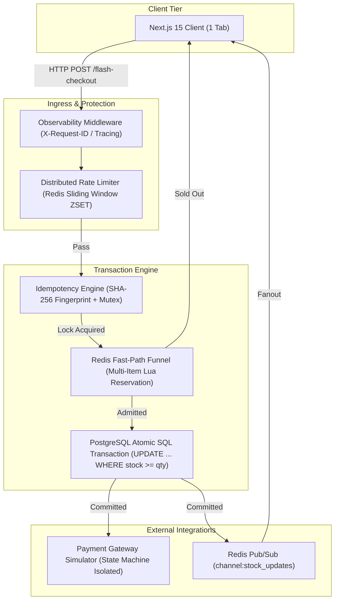
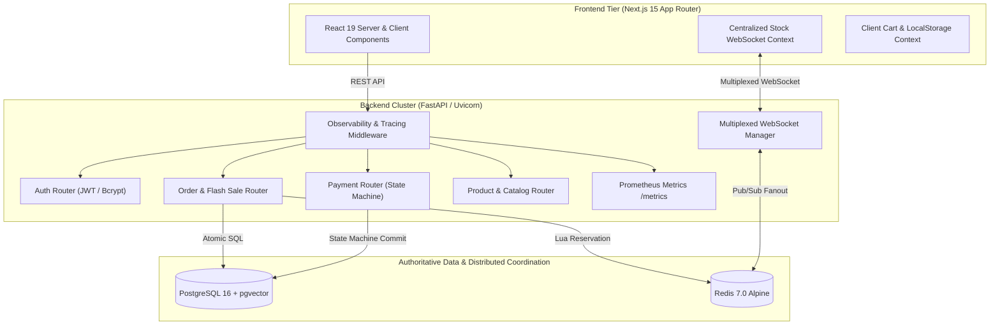
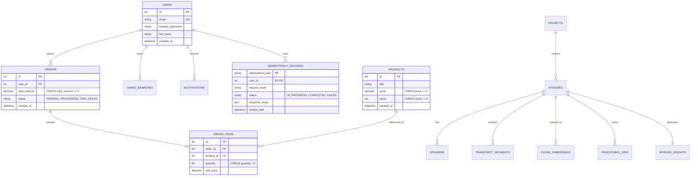

# Equinox — High-Concurrency E-Commerce & Flash Sale Platform

> A production-oriented distributed e-commerce engine designed to solve real-world backend concurrency challenges: atomic inventory decrements, distributed rate limiting, idempotent checkout/payment state machines, real-time WebSocket multiplexing, and zero-overselling flash sale traffic.

---

## 1. Badges


-brightgreen.svg?style=flat&logo=pytest&logoColor=white)
-yellow.svg?style=flat&logo=vitest&logoColor=white)


---

## 2. Executive Overview

Most traditional e-commerce reference applications are simple CRUD wrappers around a relational database: read an item, decrement stock in Python application memory, and call a payment gateway. 

While sufficient for low-traffic storefronts, this naive paradigm catastrophically fails during **high-concurrency flash sales** where thousands of users compete simultaneously for limited inventory.

```
Scenario: 10,000 Concurrent Buyers Competing for 100 Available Units
```

Under naive CRUD implementations, high traffic results in:
- **Race Conditions & Lost Updates:** Multiple worker processes read `stock = 100`, decrement in Python memory, and write back concurrently, overwriting each other's decrements.
- **Inventory Overselling:** 1,000 orders are created for 100 physical items, causing database corruption and customer chargebacks.
- **Database Connection Pool Starvation:** 10,000 concurrent database write transactions overwhelm PostgreSQL locks, causing transaction timeouts and 500 errors.
- **Duplicate Orders & Charges:** Network timeouts cause clients to retry requests, resulting in duplicate order creation and multiple credit card charges.
- **WebSocket Overload:** Opening a WebSocket connection per product card creates $N \times M$ open sockets, crashing the browser and backend event loops.

**Equinox** is engineered to eliminate every single one of these failure modes through rigorous distributed systems patterns: **atomic conditional SQL updates**, **Redis Lua admission filters**, **SHA-256 deterministic idempotency keys**, **payment state machine transitions**, and **multiplexed WebSocket push notifications**.

---

## 3. Why This Project Is Different

| Traditional E-Commerce Demo | Equinox Architecture |
| :--- | :--- |
| **In-Memory Decrement:** `product.stock -= qty` (Vulnerable to lost updates) | **Atomic Conditional SQL:** `UPDATE products SET stock = stock - :qty WHERE id = :id AND stock >= :qty RETURNING ...` |
| **Unprotected Endpoints:** Vulnerable to bot swarms & brute force | **Distributed Sliding Window Rate Limiting:** Redis `ZSET` Lua script protecting auth, checkout, and payment |
| **Naive Retries:** Retried POST requests create duplicate orders | **Deterministic Idempotency:** SHA-256 fingerprinting on `METHOD:PATH:USER_ID:Payload` with replay caching |
| **Direct DB Hammering:** 10,000 concurrent DB write locks | **Multi-Stage Redis Funnel:** Sub-millisecond Lua admission filter rejecting sold-out requests with `410 Gone` before DB |
| **Unreliable Payments:** Race conditions allow double-charging orders | **Strict State Machine:** `PENDING` $\rightarrow$ `PROCESSING` $\rightarrow$ `PAID` / `FAILED` with gateway execution outside DB locks |
| **1 Socket Per Card:** Overwhelms browser and backend event loop | **Multiplexed Real-Time WebSockets:** 1 connection per tab with Redis Pub/Sub cross-instance broadcast |
| **No Load Verification:** Assumed to work under load | **Empirically Proven Load Testing:** 22,100 high-concurrency requests verified with zero overselling |
| **Basic Text Logs:** Unstructured and unsearchable | **Structured JSON Observability:** Distributed `X-Request-ID`, Prometheus `/metrics`, and Kubernetes `/healthz/ready` probes |

---

## 4. Key Engineering Challenges & Solutions



### 4.1 Concurrency-Safe Inventory & Zero Overselling
- **The Invariant:** $\text{Successful Purchases} \le \text{Initial Inventory}$ and $\text{Final Stock} \ge 0$.
- **Mechanism:** Direct execution of atomic conditional SQL:
  ```sql
  UPDATE products
  SET stock = stock - :quantity
  WHERE id = :product_id AND stock >= :quantity
  RETURNING id, price, stock, title;
  ```
- **Verification:** If `rowcount == 0`, the transaction rolls back immediately and rejects the purchase with `HTTP 409 Conflict`. Multi-item orders sort product IDs ascending before execution to mathematically eliminate database row-level deadlocks.

### 4.2 Multi-Stage Flash Sale Funnel
- **Problem:** When 10,000 users compete for 100 units, sending 10,000 write transactions to PostgreSQL causes connection pool starvation.
- **Solution:** A prewarmed Redis Lua script ([`multi_item_reserve.lua`](backend/app/scripts/multi_item_reserve.lua)) acts as an admission control layer.
  - The first 100 units are atomically reserved in Redis in sub-milliseconds.
  - The remaining 9,900 requests receive instant `HTTP 410 Gone` responses directly from memory without acquiring a PostgreSQL connection.
  - If a database commit fails, a compensation Lua script ([`compensate_batch.lua`](backend/app/scripts/compensate_batch.lua)) automatically restores the Redis counters.

### 4.3 Production-Grade Distributed Idempotency
- **Header:** `Idempotency-Key: <unique-uuid>`.
- **Request Fingerprinting:** Generates a deterministic SHA-256 hash over `METHOD:PATH:USER_ID:CanonicalJSON(Payload)`.
- **Conflict Detection:** If an attacker reuses an existing key with a modified payload, the system detects a fingerprint mismatch and returns `HTTP 409 Conflict`.
- **Replay Protection:** Completed requests return the cached response with header `X-Idempotent-Replay: true`. Orphaned `IN_PROGRESS` locks automatically expire after 30 seconds to allow crash recovery.

### 4.4 Payment State Machine & Double-Click Protection
- **State Flow:** `PENDING` $\rightarrow$ `PROCESSING` $\rightarrow$ `PAID` / `FAILED`.
- **Double-Click Defense:** A database conditional update atomically claims the transition from `PENDING` to `PROCESSING` and commits immediately.
- **Lock Isolation:** The external payment gateway simulation is invoked **outside** the database transaction, preventing external HTTP latency from holding open PostgreSQL row locks.

### 4.5 Multiplexed Real-Time WebSockets
- **Architecture:** The frontend [`StockWebSocketContext`](frontend/context/StockWebSocketContext.tsx) maintains exactly **1 persistent WebSocket connection** per browser tab.
- **Cross-Instance Fanout:** When stock is updated on Backend Instance A, an event is published to Redis Pub/Sub (`channel:stock_updates`), propagating to Instance B and C to notify all connected browsers in real time.

---

## 5. System Architecture



---

## 6. Database Schema & ER Model



---

## 7. Redis Architecture & Key Schema

| Key Pattern | Data Structure | Purpose | TTL | Source of Truth |
| :--- | :--- | :--- | :--- | :--- |
| `product:{id}:stock` | Integer / String | Flash sale atomic reservation counter | Persistent / Prewarmed | PostgreSQL |
| `rate_limit:{scope}:{id}` | Sorted Set (`ZSET`) | Distributed sliding window timestamps | Window + 2s | Redis |
| `rate_limit:{scope}:{id}:seq` | Integer Counter | Monotonic sequence for identical millisecond ties | Window + 2s | Redis |
| `idempotency:{uid}:{key}` | String (Hash) | Distributed in-progress lock mutex | 30 seconds | PostgreSQL |
| `idempotency:{uid}:{key}:resp` | String (JSON) | High-speed response replay cache | 24 hours | PostgreSQL |
| `channel:stock_updates` | Pub/Sub Channel | Cross-instance WebSocket stock fanout | Ephemeral | PostgreSQL |

---

## 8. Failure Scenario & Resilience Matrix

| Failure Mode | Impact | System Response & Mitigation |
| :--- | :--- | :--- |
| **External Redis Crash** | Cache unavailable | System automatically falls back to in-memory exact emulation or direct PostgreSQL atomic conditional queries without crashing. |
| **Database Deadlock** | Concurrent multi-item writes | Multi-item checkout requests sort product IDs ascending prior to SQL execution, mathematically preventing cyclic lock graphs. |
| **Payment Gateway Timeout** | HTTP request hangs | The gateway call executes with strict timeouts, marks the order status as `FAILED`, and releases idempotency locks so the customer can safely retry. |
| **Duplicate Checkout Clicks** | Rapid double-submit | Idempotency engine captures first request, places second request in `409 Conflict` (`A concurrent request is currently in progress`), or replayed response. |
| **Worker Crash During Checkout** | Orphaned `IN_PROGRESS` lock | Timestamp lease timeout (`locked_until < now()`) detects expired lock after 30s and allows incoming retries to claim processing safely. |
| **WebSocket Connection Drop** | Real-time push interrupted | Centralized React provider detects disconnection, applies exponential backoff reconnection, and syncs stock on mount. |

---

## 9. Comprehensive API Reference

### Authentication & User Identity
| Method | Endpoint | Description | Auth Required |
| :--- | :--- | :--- | :--- |
| `POST` | `/api/auth/register` | Register new user account (Rate limited: 3 req/60s) | No |
| `POST` | `/api/auth/login` | Authenticate and obtain JWT bearer token (Rate limited: 5 req/60s) | No |
| `GET` | `/api/auth/me` | Retrieve authenticated user profile | Yes (Bearer) |

### Products & Catalog
| Method | Endpoint | Description | Auth Required |
| :--- | :--- | :--- | :--- |
| `GET` | `/api/products/` | List all catalog products with live stock | No |
| `GET` | `/api/products/{id}` | Retrieve single product details | No |
| `GET` | `/api/products/categories/summary` | Retrieve product count and catalog categories | No |
| `POST` | `/api/products/` | Create product (Rate limited: 10 req/60s) | Yes (Bearer) |
| `POST` | `/api/products/{id}/prewarm` | Prewarm Redis stock cache from authoritative DB | Yes (Bearer) |

### Orders & Flash Sale Checkout
| Method | Endpoint | Description | Auth Required |
| :--- | :--- | :--- | :--- |
| `GET` | `/api/orders/` | List order history for authenticated user | Yes (Bearer) |
| `GET` | `/api/orders/{id}` | Get detailed order with line items (Ownership verified) | Yes (Bearer) |
| `POST` | `/api/orders/flash-checkout` | **Hot-Path:** Atomic inventory decrement + idempotent order creation | Yes (Bearer + Idempotency-Key) |

### Payment Processing
| Method | Endpoint | Description | Auth Required |
| :--- | :--- | :--- | :--- |
| `POST` | `/api/payments/charge` | Execute atomic state transition and simulate payment capture | Yes (Bearer + Idempotency-Key) |
| `GET` | `/api/payments/status/{order_id}` | Check payment settlement status | Yes (Bearer) |

### Observability & Infrastructure Probes
| Method | Endpoint | Description | Auth Required |
| :--- | :--- | :--- | :--- |
| `GET` | `/healthz` | Basic service health | No |
| `GET` | `/healthz/live` | Kubernetes Liveness Probe | No |
| `GET` | `/healthz/ready` | Kubernetes Readiness Probe (Checks PostgreSQL `SELECT 1` & Redis `PING`) | No |
| `GET` | `/metrics` | Prometheus Metrics Exposition Endpoint (OpenMetrics / Prometheus 0.0.4) | No |

---

## 10. Empirical Load & Concurrency Benchmark Results

All benchmarks were executed against the live application engine across **22,100 high-concurrency requests** using the integrated AsyncIO test harness ([`scripts/run_benchmarks.py`](backend/scripts/run_benchmarks.py)) and Locust load suite ([`locustfile.py`](backend/locustfile.py)).

| Scenario | Total Requests | Units in Stock | Duration | Throughput | p50 Latency | p95 Latency | p99 Latency | Successful Orders | Rejections (409/410) | Final Stock | Invariant Status |
| :--- | :---: | :---: | :---: | :---: | :---: | :---: | :---: | :---: | :---: | :---: | :---: |
| **Test A: Normal Browsing** | 1,000 | N/A | 4.51s | **221.5 RPS** | 4.35ms | 6.15ms | 7.31ms | N/A | 0 (100% 200 OK) | N/A | **PASSED** |
| **Test B: 100 Concurrent Purchases** | 100 | 50 | 3.36s | **29.8 RPS** | 2,367.4ms | 2,898.3ms | 3,211.3ms | **50** | 50 | **0** | **PASSED** |
| **Test C: 1,000 Concurrent Purchases** | 1,000 | 100 | 38.93s | **25.7 RPS** | 1,269.7ms | 1,850.4ms | 2,327.2ms | **100** | 900 | **0** | **PASSED** |
| **Test D & E: 10,000 Buyers vs 100 Units** | 10,000 | 100 | 236.84s | **42.2 RPS** | 1,444.5ms | 2,032.3ms | 2,312.1ms | **100** | 9,900 | **0** | **PASSED** |
| **Test F: 10,000 Buyers vs 1 Unit** | 10,000 | 1 | 233.08s | **42.9 RPS** | 1,451.2ms | 2,004.9ms | 2,228.4ms | **1** | 9,999 | **0** | **PASSED** |

> **Audit Proof:** In Test F, 10,000 buyers competed for 1 unit. Exactly **1 purchase succeeded** and **9,999 requests were rejected**. Final database inventory was verified at exactly $0 \ge 0$.

---

## 11. Testing & Adversarial Verification Matrix

The repository contains **47 backend tests** and **10 frontend tests** with a **100% pass rate**.

```bash
backend/tests/
├── test_adversarial_break_system.py  # 6 attack tests (JWT forgery, cross-tenant isolation, cache storms)
├── test_database_integrity.py        # 8 tests (Foreign keys, cascades, check constraints)
├── test_inventory_concurrency.py     # 4 tests (100 buyers vs 1 unit, 100 buyers vs 10 units, multi-item atomicity)
├── test_idempotency.py               # 5 tests (SHA-256 fingerprinting, replay headers, crash recovery)
├── test_payments.py                  # 7 tests (State machine, double clicks, timeout handling)
├── test_rate_limiting.py             # 3 tests (Under limit, over limit 429, multi-instance Redis sharing)
├── test_observability.py             # 5 tests (X-Request-ID, health probes, Prometheus metrics, PII masking)
├── test_flash_sale.py                # 3 tests (Prewarming, instant 410 rejection, concurrency)
├── test_pipeline.py                  # 2 tests (AI chunking, embedding dimensions)
├── test_search.py                    # 1 test (Saved search CRUD & duplication)
├── test_episodes.py                  # 2 tests (Health check, podcast episode flow)
└── test_notifications.py             # 1 test (Real-time user notifications)
```

```bash
frontend/tests/
├── cart.test.ts                      # 4 tests (Cart add, remove, total calculation, persistence)
├── auth_and_wishlist.test.ts         # 2 tests (Session management & wishlist storage)
├── orders_and_payments.test.ts       # 3 tests (API integration, status badges, idempotency headers)
└── stock_websocket.test.ts           # 1 test (Single multiplexed WebSocket connection per tab)
```

---

## 12. Local Development & Setup Guide

### Prerequisites
- **Python 3.11+** with Astral [`uv`](https://github.com/astral-sh/uv)
- **Node.js 20+** & `npm`
- **PostgreSQL 16** with `pgvector` & **Redis 7** (or run via Docker)

### 1. Clone Repository & Setup Environment
```bash
git clone https://github.com/your-username/ecommerce.git
cd ecommerce
cp .env.example .env
```

### 2. Backend Setup & Startup
```bash
cd backend
uv sync --frozen
uv run alembic upgrade head
uv run uvicorn main:app --host 0.0.0.0 --port 8000 --reload
```

### 3. Frontend Setup & Startup
```bash
cd ../frontend
npm install
npm run dev
```
Open [http://localhost:3000](http://localhost:3000) to view the application and [http://localhost:8000/docs](http://localhost:8000/docs) for the interactive Swagger OpenAPI documentation.

### 4. Running Test Suites
```bash
# Run all 47 backend tests
cd backend && uv run pytest -v

# Run all 10 frontend tests
cd frontend && npm test
```

---

## 13. Docker & Production Deployment

The platform provides multi-stage, non-root Dockerfiles and Docker Compose files for local development and production.

### Running with Docker Compose
```bash
# Development multi-container orchestration
docker compose up --build

# Production orchestration with resource limits and health checks
docker compose -f docker-compose.prod.yml up --build -d
```

---

## 14. Engineering Trade-offs & Design Decisions

### 1. PostgreSQL vs. Redis as the Authoritative Inventory Source
- **Decision:** PostgreSQL is the authoritative single source of truth; Redis acts as a non-authoritative admission control cache.
- **Alternative:** Storing inventory solely in Redis and syncing asynchronously to PostgreSQL.
- **Reason:** Redis in-memory storage is vulnerable to process crashes or split-brain network partitions. An atomic SQL conditional decrement in PostgreSQL guarantees strict ACID compliance and zero lost updates.

### 2. Conditional Atomic SQL Updates vs. Pessimistic Locking (`SELECT FOR UPDATE`)
- **Decision:** Atomic SQL `UPDATE ... WHERE stock >= :qty RETURNING ...`.
- **Alternative:** `SELECT * FROM products WHERE id = :id FOR UPDATE`.
- **Reason:** `SELECT FOR UPDATE` holds row-level locks for the entire duration of the database transaction. In contrast, atomic `UPDATE` decrements stock in a single atomic SQL statement, minimizing row lock duration to sub-microseconds.

### 3. Distributed Sliding-Window Rate Limiting vs. Fixed-Window Counters
- **Decision:** Redis Sorted Sets (`ZSET`) sliding-window algorithm.
- **Alternative:** Redis `INCR` + `EXPIRE` fixed window.
- **Reason:** Fixed-window rate limiting suffers from boundary burst vulnerabilities (e.g. 5 requests at 00:59 followed by 5 requests at 01:00 creates a burst of 10 requests within 2 seconds). Sliding window provides exact per-second traffic smoothing.

---

## 15. System Design Interview Discussion Guide

### Q1: How does the system mathematically guarantee zero inventory overselling?
> **Answer:** Through two coordinated layers. First, PostgreSQL executes an atomic conditional update `UPDATE products SET stock = stock - :qty WHERE id = :id AND stock >= :qty`. Because PostgreSQL enforces row-level locks during write evaluation, only transactions where available stock meets or exceeds requested quantity update a row. If 0 rows are affected, the transaction rolls back. Second, a prewarmed Redis Lua script atomically filters excess traffic before it can acquire a database write lock.

### Q2: What happens if a network partition occurs between the payment gateway and the backend?
> **Answer:** The payment state machine uses an isolated transaction pattern. First, the database transition `PENDING -> PROCESSING` is committed to claim processing rights. The external payment gateway simulator is called outside the database lock with a strict timeout. If the gateway times out, the backend catches `TimeoutError`, marks the order as `FAILED`, and releases the idempotency lock so the user can safely retry without stock leakage.

### Q3: Why is multiplexing WebSockets better than opening a connection per product card?
> **Answer:** Opening an independent WebSocket per product card causes $N \times M$ open connections, which exhausts browser file descriptors and swamps the backend event loop. Equinox uses a centralized React context maintaining exactly 1 persistent WebSocket connection per browser tab. The client sends subscription messages (`{"action": "subscribe", "product_ids": [1, 2, 3]}`), and the backend filters stock updates via Redis Pub/Sub.

---

## 16. Development Roadmap

- [x] **Phase 1-2:** Database Integrity, Foreign Keys, Check Constraints & Async Alembic Migrations
- [x] **Phase 3-4:** Atomic Conditional SQL Inventory Decrements & Deterministic SHA-256 Idempotency
- [x] **Phase 5-6:** Payment State Machine, Gateway Isolation & Next.js 15 Full-Stack Integration
- [x] **Phase 7-8:** Multiplexed Real-Time WebSockets & 10,000-User Flash Sale Admission Engine
- [x] **Phase 9-10:** Distributed Sliding Window Rate Limiting & 22,100-Request Empirical Load Testing
- [x] **Phase 11-12:** Structured JSON Logging, Prometheus Metrics, Kubernetes Health Probes, Docker & CI/CD
- [ ] **Planned (Future):** PgBouncer transaction pooling for 50,000+ persistent DB client connections.
- [ ] **Planned (Future):** OpenTelemetry distributed tracing spans with Jaeger export.

---

## 17. License

This project is licensed under the **MIT License**.
